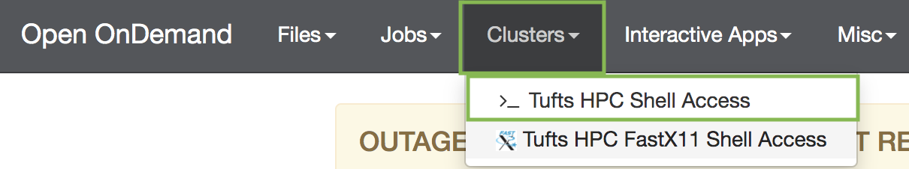

## Setup

Approximate time: 20 minutes

## Goals
- Connect to the HPC cluster via On Demand Interface
- Download data

# Log into the HPC cluster's On Demand interface
- Open a Chrome browser visit [ondemand.cluster.tufts.edu](ondemand.cluster.tufts.edu)
- Log in with your Tufts Credentials
- On the top menu bar choose Clusters->HPC Shell Access



- Type your password at the prompt (the password will be hidden for security purposes):

`whuo01@login.cluster.tufts.edu's password:`

- You'll see a welcome message and a bash prompt, for example for user `whuo01`:

`[whuo01@login001 ~]$`
This indicates you are logged in to the login node.

- Type `clear` to clear the screen

# Compute node allocation
- Get an interactive session on a compute node by typing:

`srun --pty -t 3:00:00  --mem 16G  -N 1 -n 4 bash`

Once you hit enter, you will see something like below showing that the job is queued:
```
[whuo01@login001 ~]$ srun --pty -t 3:00:00  --mem 16G  -N 1 -n 4 bash
srun: job 55918493 queued and waiting for resources
```
If wait times are very long, you can try a different partitions by adding, e.g. `-p interactive` before `bash`.
Or, if you are you registered for the workshop, you can use following option before `bash`: `-p preempt --reservation=bioworkshop`.
This reservation will be available for one week after the workshop start.
You can press `Ctrl-C` to cancel your request and try again with different options, e.g.:
```
[whuo01@login001 ~]$ srun --pty -t 3:00:00  --mem 16G  -N 1 -n 4 -p interactive bash
[whuo01@pcomp45 ~]$
```

The success is indicated by the change of node name after your username. Here it was changed from `login001` to `pcomp45`. 
This is an indication that you may proceed to the next step.
Note: If you go through this workshop in multiple steps, you will have to rerun this step each time you log in.

# Course data
- Since our home directory will likely not have enough space for the analysis (> 3Gb), we'll work in a course directory. 
Your work will be saved here for 30 days.**  Change to the course directory

```
cd /cluster/tufts/bio/tools/training/intro-to-rnaseq/users/
```

**Note: If you have a project directory for your lab, you may use this instead.
These are located in `/cluster/tufts` with names like `/cluster/tufts/labname/username/`.
If you don't know whether you have project space, please email [tts-research@tufts.edu](mailto:tts-research@tufts.edu).

- Make a directory for your work (replace `whuo01` in the below commands with your username)
```
mkdir whuo01
cd whuo01
```

- Copy the course files into your own directory:
```
cp /cluster/tufts/bio/tools/training/intro-to-rnaseq/intro-to-RNA-seq-May-2020.tar.gz .
```

- Unzip the course directory:
```
tar -xvzf intro-to-RNA-seq-May-2020.tar.gz
```

- Take a look at the contents of the unzipped directory by typing:
`tree intro-to-RNA-seq`

Result:
```
intro-to-RNA-seq/
├── ERP004763_info.txt                 <-- sample description
├── raw_data                           <-- Folder with fastq files
│   ├── sample_info.txt
│   ├── SNF2
│   │   ├── ERR458500.fastq.gz         <-- gzip compressed fastq files
│   │   ├── ERR458501.fastq.gz
│   │   ├── ERR458502.fastq.gz
│   │   ├── ERR458503.fastq.gz
│   │   ├── ERR458504.fastq.gz
│   │   ├── ERR458505.fastq.gz
│   │   └── ERR458506.fastq.gz
│   └── WT
│       ├── ERR458493.fastq.gz
│       ├── ERR458494.fastq.gz
│       ├── ERR458495.fastq.gz
│       ├── ERR458496.fastq.gz
│       ├── ERR458497.fastq.gz
│       ├── ERR458498.fastq.gz
│       └── ERR458499.fastq.gz
└── scripts                           <-- Folder with all commands
    ├── fastqc.sh
    ├── featurecounts.sh
    ├── intro.R
    ├── sbatch_star_align_individual.sh
    ├── sbatch_star_align.sh
    └── sbatch_star_align_SNF2.sh

4 directories, 22 files
```

## Data for the class

Publication: [Statistical Models for RNA-seq Data Derived From a Two-Condition 48-replicate Experiment.](https://pubmed.ncbi.nlm.nih.gov/26206307/?utm_source=gquery&utm_medium=referral&utm_campaign=CitationSensor)

Purpose: The experiment seeks to compare a wild type Saccharomyces cerevisiae with a mutant that contains a knock-out in the gene SNF2.
The purpose of the study is to analyze variability in sequencing replicates.

Project access number: [PRJEB5348](https://www.ncbi.nlm.nih.gov/bioproject/PRJEB5348)

Samples: The `WT` folder contains 7 sequencing files from a wild type yeast sample, `SNF2` contains 7 sequencing files from a yeast sample with a knock-out mutation in the gene SNF2.
Note that for the workshop purposes we are treating the 7 sequencing files as if they originate from separate biological replicates.

Organism: Saccharomyces cerevisiae

Sequencing: Illumina HiSeq, Single End, 50bp read length

## Workshop Schedule
- [Course Home](../README.md)
- [Introduction](slides/RNAseq_intro_RB_28May20.pdf)
- Currently at: Setup using Tufts HPC
- Next: [Quality Control](02_Quality_Control.md)
- [Read Alignment](03_Read_Alignment.md)
- [Gene Quantification](04_Gene_Quantification.md)
- [Differential Expression](05_Differential_Expression.md)
- [Pathway Enrichment](06_Pathway_Enrichment.md)
