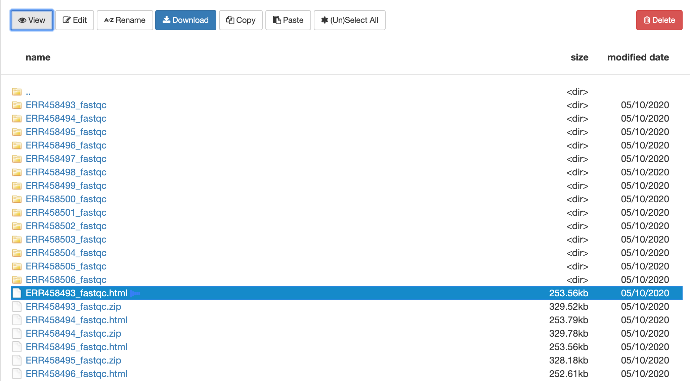
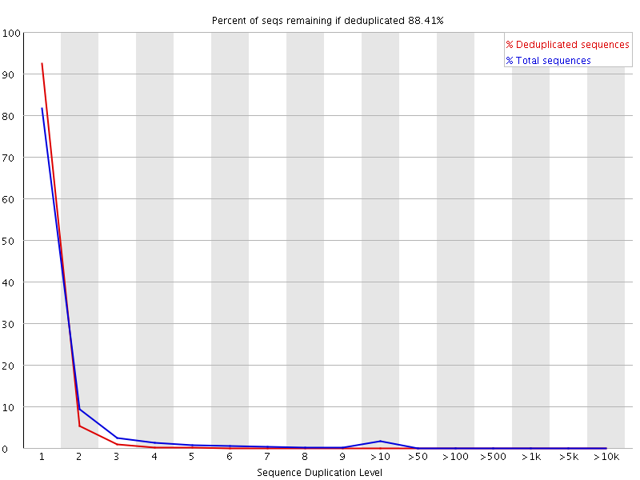
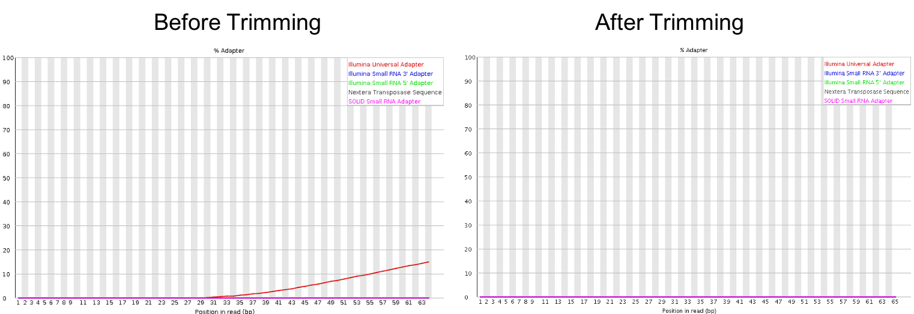

Approximate time: 20 minutes

## Goals
- Understand FastQ file format
- Run FastQC to asses data quality

## Take a look at our raw data

### Fastq format
From our course directory `intro-to-RNA-seq` change into the raw data directory:
```markdown
cd raw_data
```

Use the command `head` to look at the first few lines of our first fastq file.

```markdown
gzip -cd WT_1/ERR458493.fastq.gz | head
```

Result (arrows on the right show explanation of each line):

```bash
@ERR458493.1 DHKW5DQ1:219:D0PT7ACXX:1:1101:1724:2080/1       <-- Sequence identifier: @Read ID
CGCAAGACAAGGCCCAAACGAGAGATTGAGCCCAATCGGCAGTGTAGTGAA          <-- Sequence
+                                                            <-- + (optionally lists the sequence identifier again)
B@@FFFFFHHHGHJJJJJJIJJGIGIIIGI9DGGIIIEIGIIFHHGGHJIB          <-- Quality String
```

### Base Quality Scores

The symbols we see in the read quality string are an encoding of the quality score.

<figure>
<figcaption> Figure 1: Mapping of encoded quality score to quality score </figcaption>

</figure>

A quality score represents the probability that the nucleotide in the DNA sequence produced was not the same as the nucleotide in the sample being sequenced. The the calibration of quality scores is performed by the manufacturer of the sequencing instrument. Calibration is performed by sequencing many well-characterized samples from multiple organisms and studying the correspondence between properties of the signal generated by the cluster being sequenced and the accuracy of the resulting sequence.

<figure>
<figcaption> Figure 2: Table mapping quality scores to call accuracy  </figcaption>

</figure>

Looking back at our sample read, we can see that the first base has an encoded quality score of `C`.
Using Figure 1, we see that C encodes a quality of 34.
Using Figure 2, we see that the probability is < 1/1000 of that base being an error.

More information on Quality scores from [Illumina](https://www.illumina.com/content/dam/illumina-marketing/documents/products/technotes/technote_understanding_quality_scores.pdf)

## FastQC
FastQC is widely used tool for both DNA and RNA sequencing data that is run on each fastq file.

To use, load the module:
```bash
module load fastqc/0.11.8
```

To see the input options, type:
```bash
fastqc --help
```

Result:
```bash
fastqc --help

            FastQC - A high throughput sequence QC analysis tool

SYNOPSIS

	fastqc seqfile1 seqfile2 .. seqfileN

    fastqc [-o output dir] [--(no)extract] [-f fastq|bam|sam]
           [-c contaminant file] seqfile1 .. seqfileN
...
```

Since FastQC can run on multiple files at once, we'll use a wildcard "*" to indicate each file in the folder "raw_data":
```bash
cd ..
mkdir fastqc
fastqc raw_data/*/* -o fastqc --extract
```

Result:
```markdown
Started analysis of ERR458498.fastq.gz
Approx 20% complete for ERR458498.fastq.gz
Approx 40% complete for ERR458498.fastq.gz
Approx 65% complete for ERR458498.fastq.gz
Approx 85% complete for ERR458498.fastq.gz
Analysis complete for ERR458498.fastq.gz
Started analysis of ERR458499.fastq.gz
Approx 20% complete for ERR458499.fastq.gz
Approx 40% complete for ERR458499.fastq.gz
Approx 65% complete for ERR458499.fastq.gz
Approx 85% complete for ERR458499.fastq.gz
Analysis complete for ERR458499.fastq.gz
```
## View results in the On Demand browser

Return to the tab [ondemand.cluster.tufts.edu](ondemand.cluster.tufts.edu)

On the top menu bar choose Files->Home Directory


Navigate to the `fastqc` folder in course directory, e.g.: `/home/username/intro-to-ngs/fastqc/`
Right click on the file `na12878_1_fastqc.html` and select `Open in new tab`.



The new tab that opens in the browser has the results of FastQC for the first reads in the sample.
We'll go through each plot.  
Note that the plots shown below are for the entire sample in order to avoid artifacts of the small subsample.

## Understand FASTQC report

A video tutorial on understanding FASTQC report is strongly recommended and can be found on [Babraham bioinformatics](https://www.bioinformatics.babraham.ac.uk/projects/fastqc/).

### Per base sequence quality

Explanations adapted from [https://dnacore.missouri.edu/PDF/FastQC_Manual.pdf][https://dnacore.missouri.edu/PDF/FastQC_Manual.pdf]

This view shows an overview of the range of quality values across all bases at each position in the FastQ file


For each position a BoxWhisker type plot is drawn. The elements of the plot are as follows:
- The central red line is the median value
- The yellow box represents the inter-quartile range (25-75%)
- The upper and lower whiskers represent the 10% and 90% points
- The blue line represents the mean quality

The y-axis on the graph shows the quality scores. The higher the score the better the base call. The background of the graph divides the y axis into very good quality calls (green), calls of reasonable quality (orange), and calls of poor quality (red). The quality of calls on most platforms will degrade as the run progresses, so it is common to see base calls falling into the orange area towards the end of a read.


### Per sequence quality scores
The per sequence quality score report allows you to see if a subset of your sequences have universally low quality values. It is often the case that a subset of sequences will have universally poor quality, often because they are poorly imaged (on the edge of the field of view etc), however these should represent only a small percentage of the total sequences.


### Per base sequence content
Per Base Sequence Content plots out the proportion of each base position in a file for which each of the four normal DNA bases has been called.


In a random library you would expect that there would be little to no difference between the different bases of a sequence run, so the lines in this plot should run parallel with each other. In here, you can clearly see the biased sequence in the first ~12 bases of the run. This bias then dissipates over the rest of the run which shows the expected parallel tracks in the base content for each base.  This happens in pretty much all RNA-Seq libraries to a greater or lesser extent.

The cause of this bias is the random priming step in library production. The priming should be driven by a selection of random hexamers which in theory should all be present with equal frequency in the priming mix and should all prime with equal efficiency.  In the real world it turns out that this isn’t the case and that certain hexamers are favoured during the priming step, resulting in the based composition over the region of the library primed by the random primers.

The biased selection though doesn’t appear to be strong enough to cause major headaches in downstream quantitation of data.  A strong bias would result in a very uneven coverage of different parts of a transcript based on its sequence content, and most RNA-Seq libraries do not show these types of localised biases (excepting biases from mappability and other factors beyond this effect).  Also the biases are very similar between libraries, so any artefacts which were introduced should cancel out when doing any kind of differential analysis.


### Per sequence GC content

This module measures the GC content across the whole length of each sequence in a file
and compares it to a modelled normal distribution of GC content.


In a normal random library you would expect to see a roughly normal distribution of GC content where the central peak corresponds to the overall GC content of the underlying genome. Since we don't know the the GC content of the genome the modal GC content is calculated from the observed data and used to build a reference distribution. An unusually shaped distribution could indicate a contaminated library or some other kinds of biased subset. A normal distribution which is shifted indicates some systematic bias which is independent of base position. If there is a systematic bias which creates a shifted normal distribution then this won't be flagged as an error by the module since it doesn't know what your genome's GC content should be.

### Per base N content

If a sequencer is unable to make a base call with sufficient confidence then it will normally substitute an N rather than a conventional base call . This module plots out the percentage of base calls at each position for which an N was called.


### Sequence Length Distribution

Some high throughput sequencers generate sequence fragments of uniform length, but others can contain reads of wildly varying lengths. Even within uniform length libraries some pipelines will trim sequences to remove poor quality base calls from the end. This module generates a graph showing the distribution of fragment sizes in the file which was analysed


### Sequence Duplication Levels

In a diverse library most sequences will occur only once in the final set. A low level of duplication may indicate a very high level of coverage of the target sequence, but a high level of duplication is more likely to indicate some kind of enrichment bias (eg PCR over amplification).

This module counts the degree of duplication for every sequence in the set and creates a plot showing the relative number of sequences with different degrees of duplication.



### Overrepresented sequences

A normal high-throughput library will contain a diverse set of sequences, with no individual sequence making up a tiny fraction of the whole. Finding that a single sequence is very overrepresented in the set either means that it is highly biologically significant, or indicates that the library is contaminated, or not as diverse as you expected. This module lists all of the sequence which make up more than 0.1% of the total. To conserve memory only sequences which appear in the first 200,000 sequences are tracked to the end of the file. It is therefore possible that a sequence which is overrepresented but doesn't appear at the start of the file for some reason could be missed by this module. For each overrepresented sequence the program will look for matches in a database of common contaminants and will report the best hit it finds. Hits must be at least 20bp in length and have no more than 1 mismatch. Finding a hit doesn't necessarily mean that this is the source of the contamination, but may point you in the right direction. It's also worth pointing out that many adapter sequences are very similar to each other so you may get a hit reported which isn't technically correct, but which has very similar sequence to the actual match.
Because the duplication detection requires an exact sequence match over the whole length of the sequence any reads over 75bp in length are truncated to 50bp for the purposes of this analysis. Even so, longer reads are more likely to contain sequencing errors which will artificially increase the observed diversity and will tend to underrepresent highly duplicated sequences.

### Adapter Content

This module looks for common adapters in the sequence. In this example, there is no over represented sequences.


## Optional: Read trimming

In our `Per base sequence quality`, if we see that the read quality dropped towards the end of the read, there are likely errors in the data. In order to ensure alignment and variant calling are as accurate as possible, we can perform quality trimming of reads.

[Trim Galore](https://github.com/FelixKrueger/TrimGalore/blob/master/Docs/Trim_Galore_User_Guide.md) is a popular tool that in the default mode performs:
Quality trimming: Trims low quality bases from the 3' end of the read
Adapter trimming: Automatically detects and removes known Illumina adapters that may be present in the data

To perform trimming on the data, we first load the software:
```
module load anaconda/3
source activate /cluster/tufts/bio/tools/conda_envs/trim_galore/
```

To run:
```
mkdir trim
trim_galore -o trim raw_data/*
```

Result:
```
...
=== Summary ===

Total reads processed:                   4,652
Reads with adapters:                     1,606 (34.5%)
Reads written (passing filters):         4,652 (100.0%)

Total basepairs processed:       353,552 bp
Quality-trimmed:                  24,906 bp (7.0%)
Total written (filtered):        326,448 bp (92.3%)
...
```

Note that Trim Galore may trim adapters [even in the case where FastQC found no adapters](https://github.com/FelixKrueger/TrimGalore/issues/15).
This is because Trim Galore will remove partial adapters at the ends of reads.

The result after trimming is much improved:



## Workshop Schedule
- [Introduction](../README.md)
- [Setup using Tufts HPC](01_Setup.md)
- Currently at: Process Raw Reads
- Next: [Read Alignment](03_Read_Alignment.md)
- [Gene Quantification](04_Gene_Quantification.md)
- [Differential Expression](05_Differential_Expression.md)
- [Pathway Enrichment](06_Pathway_Enrichment.md)
