## Quality control

Approximate time: 20 minutes

## Goals
- Understand FastQ file format
- Run FastQC to asses data quality

## Take a look at our raw data
Usually RNA sequencing is performed on Illumina machines. 
If you need to refresh your memory about Illumina sequencing technology, please take a look at [this video by Illumina](https://www.illumina.com/science/technology/next-generation-sequencing/sequencing-technology.html).

- **FASTQ format**

Change into the`raw_data` directory inside our main course directory `intro-to-RNA-seq`:
```
cd intro-to-RNA-seq/raw_data
```

First, we'll take a look at our raw data.
Since our data it gzip compressed, we'll use the command `zcat` to read the file without decompressing.
We'll follow that command by the bash pip `|` and `head` in order to show only the first few lines

```
zcat WT/ERR458493.fastq.gz | head
```

The result that you see contains the first few FASTQ sequences.
Each sequence has the following 4-line format:
```bash
@ERR458493.1 DHKW5DQ1:219:D0PT7ACXX:1:1101:1724:2080/1       <-- Sequence identifier: @Read ID
CGCAAGACAAGGCCCAAACGAGAGATTGAGCCCAATCGGCAGTGTAGTGAA          <-- Sequence
+                                                            <-- + (optionally lists the sequence identifier again)
B@@FFFFFHHHGHJJJJJJIJJGIGIIIGI9DGGIIIEIGIIFHHGGHJIB          <-- Quality String
```

- **Base Quality Scores**

The fourth line of each read is called the *quality string*.
Each symbol in the string is an encoding of the *quality score*, representing the inferred base call accuracy at that
position in the read.
The manufacturer of the sequencing instrument has performed calibration of quality score by sequencing many
well-characterized samples from multiple organisms  and studying the correspondence between properties of the signal
generated by the cluster being sequenced and the accuracy of the resulting base call.

The following two images explain this encoding.
The first image shows the mapping of the encoded quality score to the quality score:

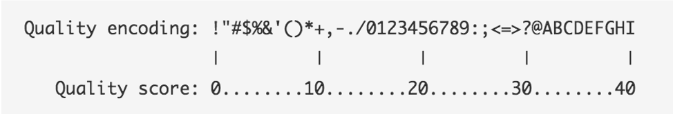

The second image shows the mapping of the quality score to the inferred base call accuracy:

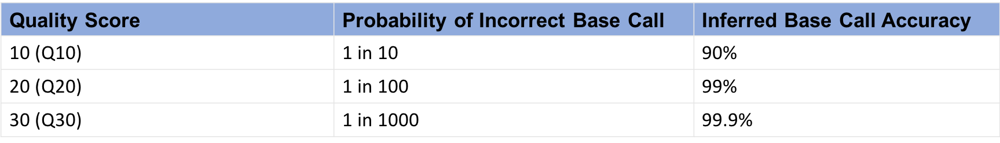

Looking back at our sample read, we can see that the first base has an encoded quality score of `C`.
Using the first image above, we see that C encodes a quality of 34.
Using the second table, we see that the probability is < 1/1000 of that base being an error.
In the next section, we'll see how quality scores and other quality control metrics are used to evaluate the quality of
a sequenced sample.

More information on Quality scores from [Illumina](https://www.illumina.com/content/dam/illumina-marketing/documents/products/technotes/technote_understanding_quality_scores.pdf)

## Perform quality control checks using FastQC toolkit
FastQC is widely used tool for both DNA and RNA sequencing data that is run on each fastq file.

- To use FastQC on HPC, first load the module:
```bash
module load fastqc/0.11.8
```

- To see the input options, type:
```bash
fastqc --help
```

Result:
```bash
fastqc --help

            FastQC - A high throughput sequence QC analysis tool

SYNOPSIS

	fastqc seqfile1 seqfile2 .. seqfileN

    fastqc [-o output dir] [--(no)extract] [-f fastq|bam|sam]
           [-c contaminant file] seqfile1 .. seqfileN
...
```

FastQC is run on each FASTQ file separately in order to be sensitive to the variation in quality over lanes, samples,
and paired-end files.

- To see an example of FASTQC output, we'll run on one file.

We add extra arguments `-o fastqc` to specify that the output should be placed in the directory we created and `--extract` to indicate that the input files are gzip compressed.

```bash
cd ..
mkdir fastqc
fastqc raw_data/WT/ERR458493.fastq.gz -o fastqc --extract
```
The extra argument `--extract` is used when the input files are gzip compressed.

Note that FastQC can run on multiple files at once, using a wildcard `*` instead of the filename `ERR458493.fastq.gz` to indicate each file in the folder `raw_data`.

Result:
```markdown
Started analysis of ERR458493.fastq.gz
Approx 5% complete for ERR458493.fastq.gz
Approx 10% complete for ERR458493.fastq.gz
Approx 15% complete for ERR458493.fastq.gz
Approx 20% complete for ERR458493.fastq.gz
Approx 25% complete for ERR458493.fastq.gz
Approx 30% complete for ERR458493.fastq.gz
Approx 35% complete for ERR458493.fastq.gz
Approx 40% complete for ERR458493.fastq.gz
Approx 45% complete for ERR458493.fastq.gz
Approx 50% complete for ERR458493.fastq.gz
Approx 55% complete for ERR458493.fastq.gz
Approx 60% complete for ERR458493.fastq.gz
Approx 65% complete for ERR458493.fastq.gz
Approx 70% complete for ERR458493.fastq.gz
Approx 75% complete for ERR458493.fastq.gz
Approx 80% complete for ERR458493.fastq.gz
Approx 85% complete for ERR458493.fastq.gz
Approx 90% complete for ERR458493.fastq.gz
Approx 95% complete for ERR458493.fastq.gz
Analysis complete for ERR458493.fastq.gz
```
## View results in the OnDemand browser

Return to the tab [ondemand.cluster.tufts.edu](ondemand.cluster.tufts.edu)

On the top menu bar choose `Files->Projects`

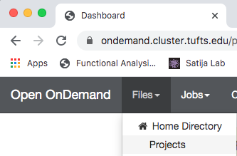

A new tab will open listing all the project folders in `/cluster/tufts/`.
Navigate to the `fastqc` folder in course directory, e.g.: `bio/tools/training/intro-to-rnaseq/users/username/intro-to-RNA-seq/fastqc/`
Right click on the file `ERR458493_fastqc.html` and select `Open in new tab`.

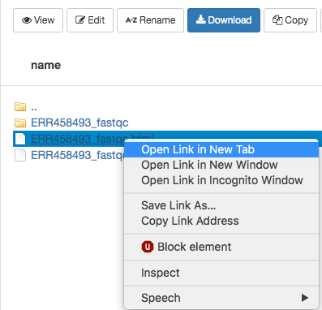

The new tab that opens in the browser has the results of FastQC for the sample.

## Understand FASTQC report

A video tutorial on understanding FASTQC report is strongly recommended and can be found on [Babraham bioinformatics](https://www.bioinformatics.babraham.ac.uk/projects/fastqc/).

- **Per base sequence quality**

Explanations adapted from [https://dnacore.missouri.edu/PDF/FastQC_Manual.pdf](https://dnacore.missouri.edu/PDF/FastQC_Manual.pdf).

This view shows an overview of the range of quality values across all bases at each position in the FastQ file

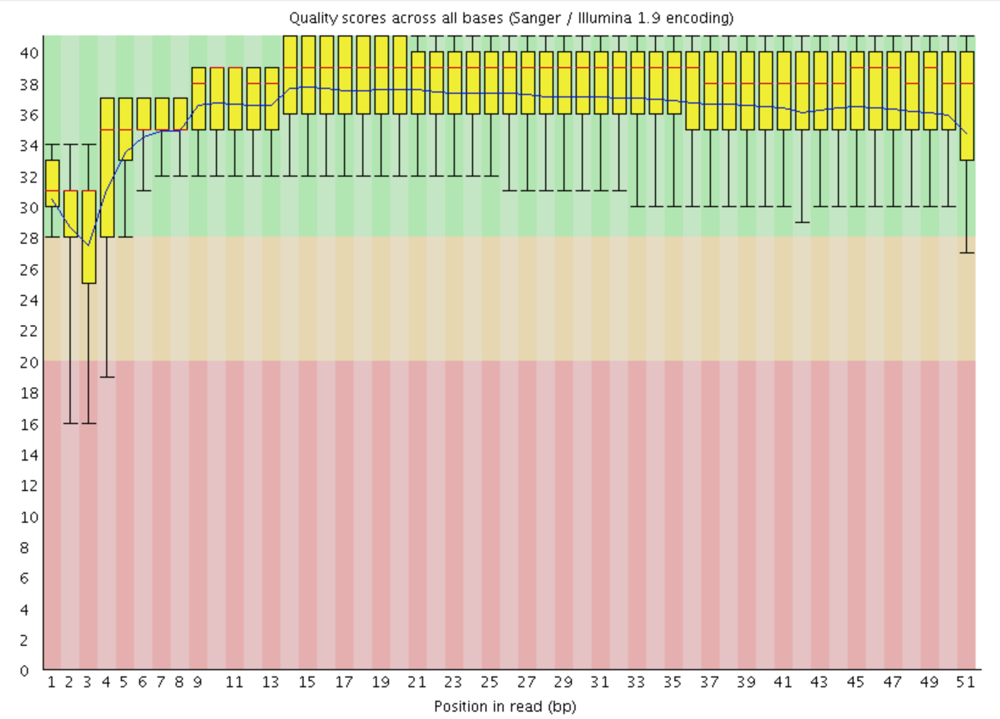

For each position a BoxWhisker type plot is drawn. The elements of the plot are as follows:
- The central red line is the median value
- The yellow box represents the inter-quartile range (25-75%)
- The upper and lower whiskers represent the 10% and 90% points
- The blue line represents the mean quality

The y-axis on the graph shows the quality scores. The higher the score the better the base call. 
The background of the graph divides the y axis into very good quality calls (green), calls of reasonable quality (orange), and calls of poor quality (red). 
The quality of calls on most platforms will degrade as the run progresses, so it is common to see base calls falling into the orange area towards the end of a read.

- **Per sequence quality scores**

The Per Sequence Quality Score plots the distribution of mean sequence quality.
This plot allows will show a peak toward lower mean quality if there is a subset of sequences with  low quality values. 

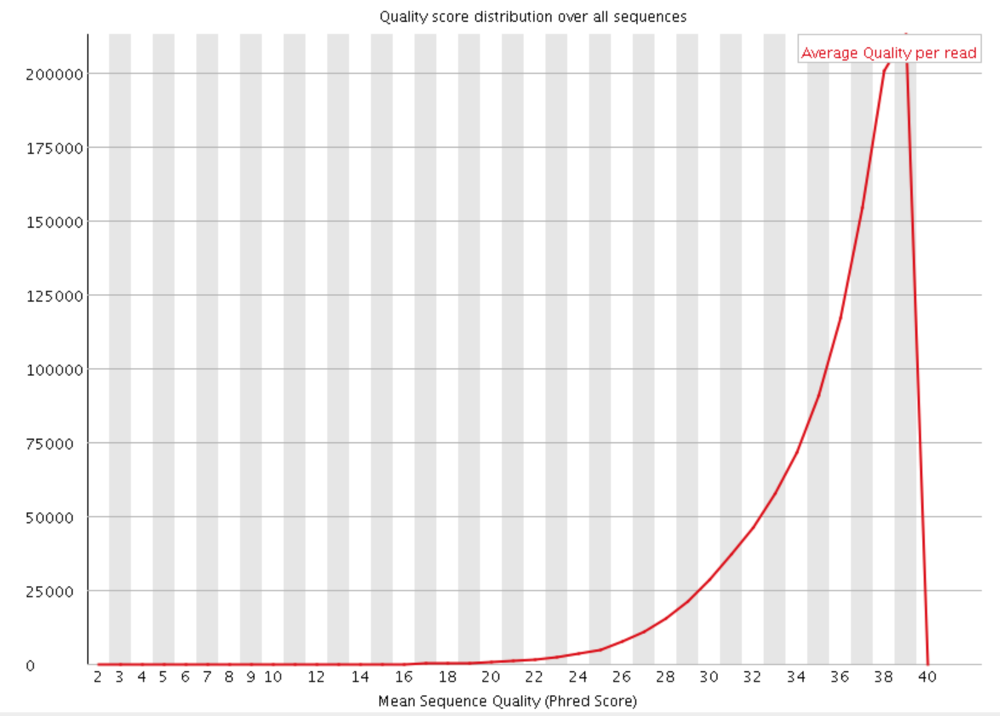

- **Per base sequence content**

The Per Base Sequence Content plot shows the the proportion of each base called at each position in the read, 
for all reads in the file.

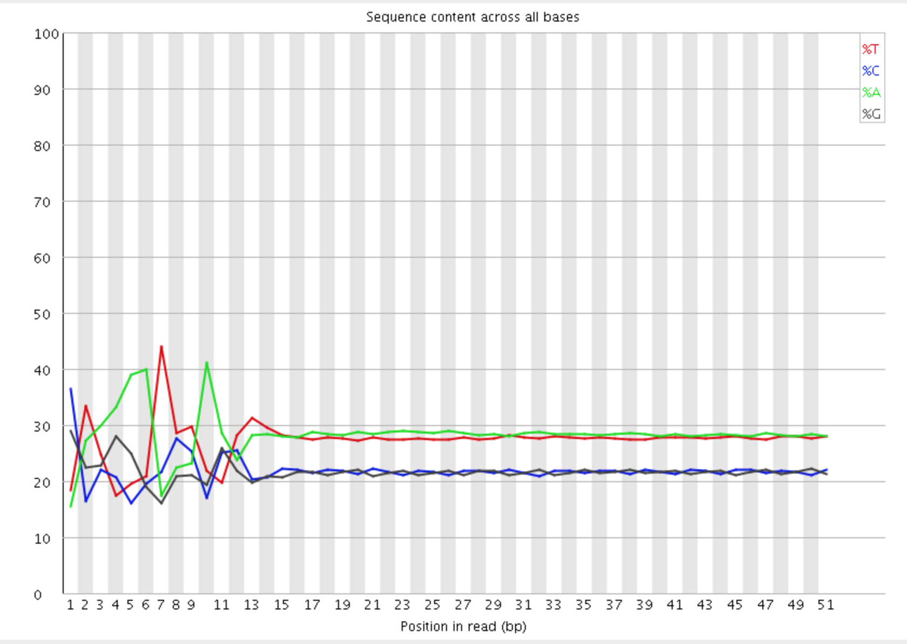

In a random library you would expect that there would be little to no difference between the different bases of a sequence run, so the lines in this plot should run parallel with each other. 
In our results, you can clearly see the biased sequence in the first ~12 bases of the run. 
This bias then dissipates over the rest of the run which shows the expected parallel tracks in the base content for each base.
This happens in pretty much all RNA-Seq libraries to a greater or lesser extent.

The cause of this bias is the random priming step in library production.
The priming should be driven by a selection of random hexamers which in theory should all be present with equal frequency in the priming mix and should all prime with equal efficiency.
In the real world it turns out that this isn’t the case and that certain hexamers are favoured during the priming step, resulting in the based composition over the region of the library primed by the random primers.

The biased selection though doesn’t appear to be strong enough to cause major headaches in downstream quantitation of data.
A strong bias would result in a very uneven coverage of different parts of a transcript based on its sequence content, and most RNA-Seq libraries do not show these types of localised biases (excepting biases from mappability and other factors beyond this effect).
Also the biases are very similar between libraries, so any artifacts which were introduced should cancel out when doing any kind of differential analysis.

[This article](https://sequencing.qcfail.com/articles/positional-sequence-bias-in-random-primed-libraries/) has more details.

- **Per sequence GC content**

This module measures the GC content across the whole length of each sequence in a file
and compares it to a modelled normal distribution of GC content.

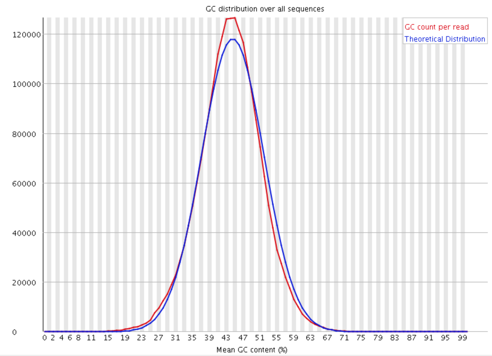

In a normal random library you would expect to see a roughly normal distribution of GC content where the central peak corresponds to the overall GC content of the underlying genome. Since we don't know the the GC content of the genome the modal GC content is calculated from the observed data and used to build a reference distribution. An unusually shaped distribution could indicate a contaminated library or some other kinds of biased subset. A normal distribution which is shifted indicates some systematic bias which is independent of base position. If there is a systematic bias which creates a shifted normal distribution then this won't be flagged as an error by the module since it doesn't know what your genome's GC content should be.

- **Per base N content**

If a sequencer is unable to make a base call with sufficient confidence then it will normally substitute an N rather than a conventional base call . 
This plot shows the percentage of base calls at each position for which an N was substituted.

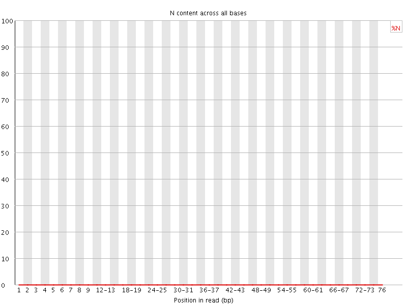


- **Sequence Length Distribution**

This plot shows the distribution of read sizes in the file.
Depending on the sequencing method and whether reads have been post-processed, it may be expected to have reads of a 
uniform length or varying lengths.
For our data we see a sharp peak at 51 basepairs.

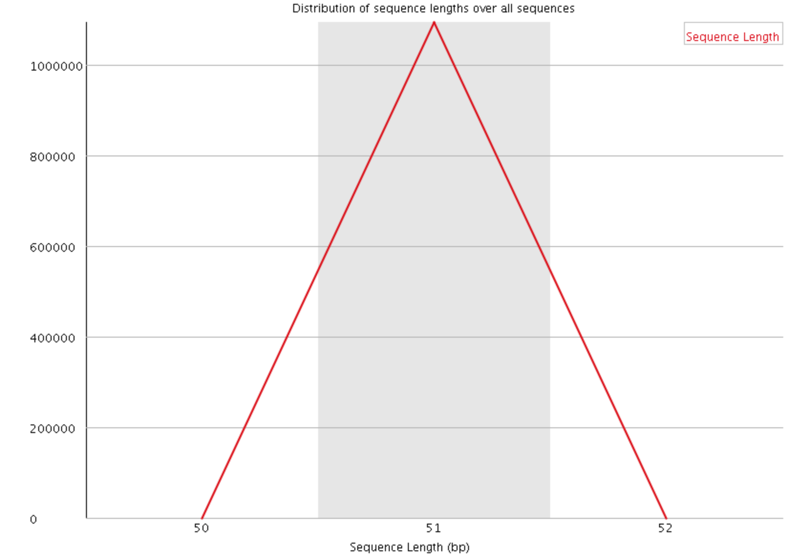

- **Sequence Duplication Levels**

This plot shows the distribution of sequence duplicates in the file.
We see that <60% of Total sequences are present exactly 1 time, and >10% are present twice.
This level of duplication is expected for RNAseq, due to the vastly different levels of transcripts in the starting population.
RNAseq libraries tend to have higher levels of duplication than DNA libraries, due to the presence of highly expressed transcripts.
Deduplication is not recommended for RNAseq sequencing files.

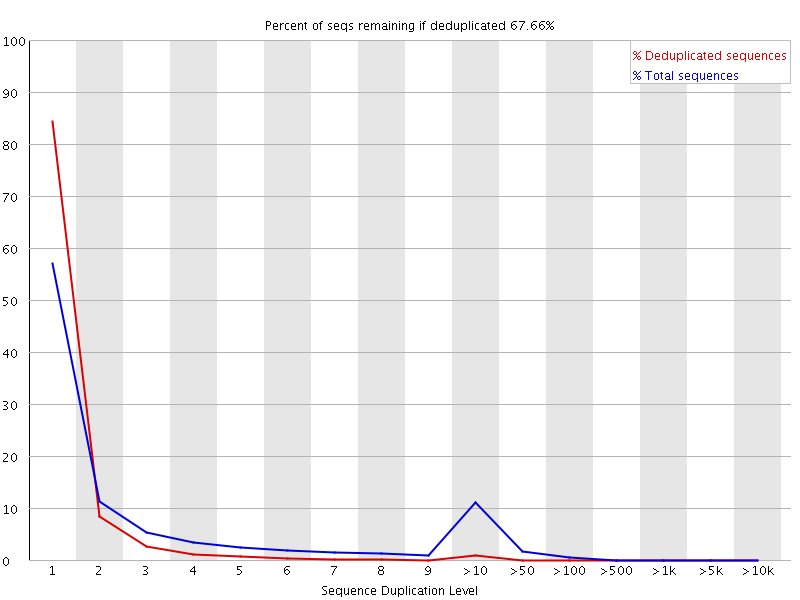

- **Overrepresented sequences**

This plot shows the sequences in the file which make up more than 0.1% of the total.
In our sample, no overrepresented sequences are found.

A normal high-throughput library will contain a diverse set of sequences, with no individual
sequence making up a more than a tiny fraction of the whole. Finding that a single sequence is very
overrepresented in the set either means that it is highly biologically significant, or indicates
that the library is contaminated, or not as diverse as you expected.

For each overrepresented sequence the program will look for matches in a database of
common contaminants and will report the best hit it finds. Hits must be at least 20bp in
length and have no more than 1 mismatch. Finding a hit doesn't necessarily mean that this
is the source of the contamination, but may point you in the right direction. It's also worth
pointing out that many adapter sequences are very similar to each other so you may get a
hit reported which isn't technically correct, but which has very similar sequence to the
actual match.

If overrepresented sequences are found but not identified by FastQC, try a 
[BLAST search](https://blast.ncbi.nlm.nih.gov/Blast.cgi).

- **Adapter Content**

This module looks for common adapters in the sequence. In this example, there are no adapters found.

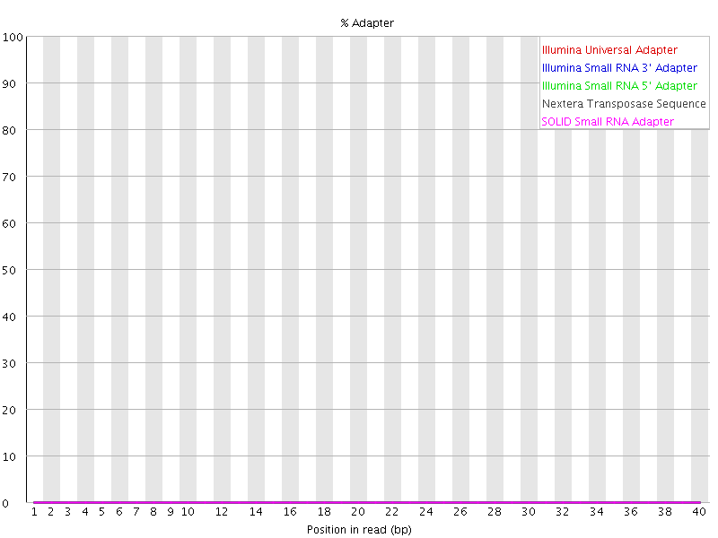

Explanations adapted from tthe [FastQC Manual](https://dnacore.missouri.edu/PDF/FastQC_Manual.pdf)

## Workshop Schedule
- [Course Home](../README.md)
- [Introduction](slides/RNAseq_intro_RB_28May20.pdf)
- [Setup using Tufts HPC](01_Setup.md)
- Currently at: Quality Control
- Next: [Read Alignment](03_Read_Alignment.md)
- [Gene Quantification](04_Gene_Quantification.md)
- [Differential Expression](05_Differential_Expression.md)
- [Pathway Enrichment](06_Pathway_Enrichment.md)
