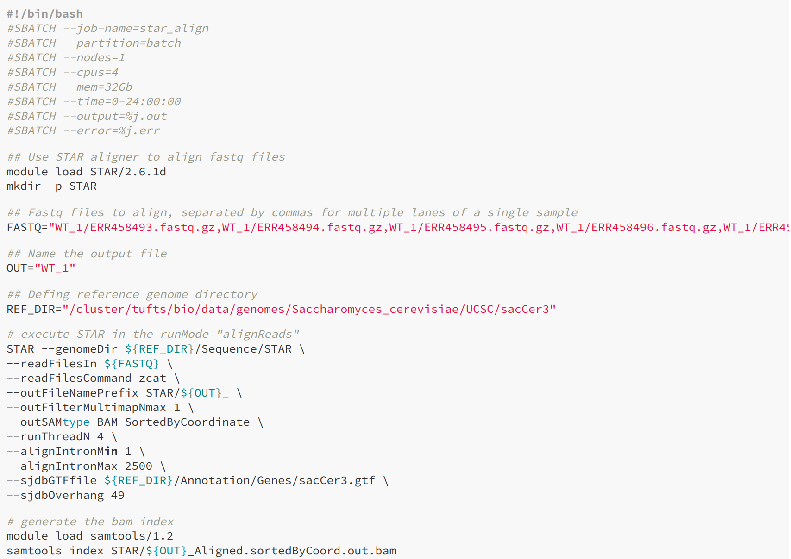
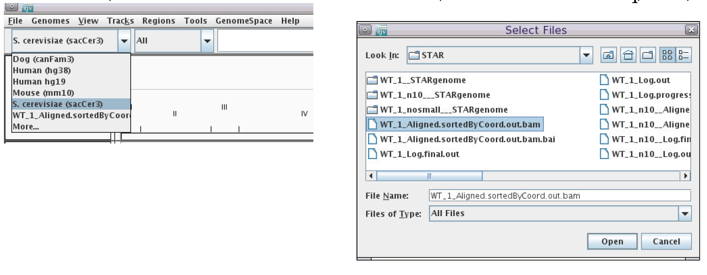
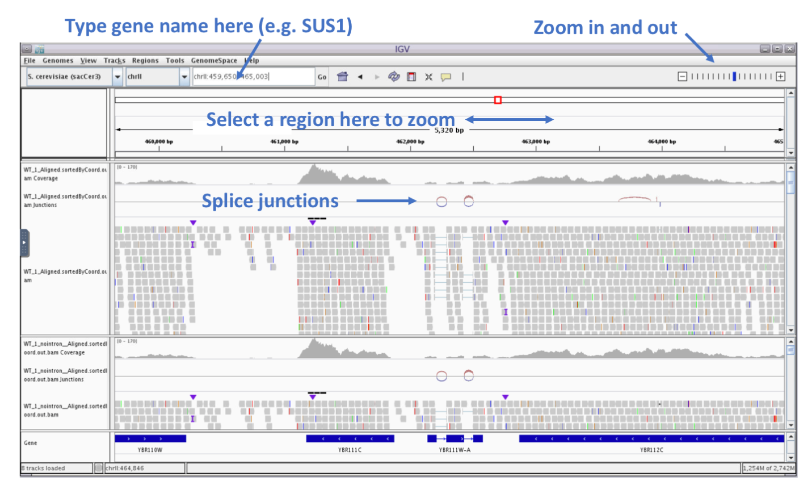

Approximate time: 20 minutes

## Goals
- Align short reads to a references genome using STAR
- View alignment using IGV


# STAR Alignment

The alignment process consists of choosing an appropriate reference genome to map our reads against and performing the read alignment using one of several splice-aware alignment tools such as STAR or HISAT2. The choice of aligner is often a personal preference and also dependent on the computational resources that are available to you.

Spliced Transcripts Alignment to a Reference ([START] (https://github.com/alexdobin/STAR)) is an aligner designed to specifically address many of the challenges of RNA-seq data mapping using a strategy to account for spliced alignments. STAR is shown to have high accuracy and outperforms other aligners by more than a factor of 50 in mapping speed, but it is memory intensive.

STAR algorithm consists of two major steps:
- seed searching step: Find Maximum Mappable Prefixes
(MMP) in a read. MMP can be extended by a. mismatches b. indels or c. soft-clipping
- clustering/stitching/scoring step: determine finl read location and deal with a large number of mismatches, indels and splice junctions, as well as scalable with the read length.


More information can be found on the publication: ["STAR: ultrafast universal RNA-seq aligner"] (https://academic.oup.com/bioinformatics/article/29/1/15/272537).

Aligning reads using STAR is a two step process:
- Create a genome index
- Map reads to the genome

# STAR Index
Tufts HPC hosts genome reference data from UCSC at the following location
```markdown
/cluster/tufts/bio/data/genomes
```
We will need reference files from Saccharomyces_cerevisiae genome version sacCer3:
```markdown
cd /cluster/tufts/bio/data/genomes/Saccharomyces_cerevisiae/UCSC/sacCer3/
```

We'll create the genome index (note: this step take 1.6G of storage, please make sure you have enough storage before proceeding.)
0. Get an interaction session on a compute node if you haven't done so
`srun --pty -t 3:00:00  --mem 16G  -N 1 -n 4 bash`

1. load the module
`module load STAR/2.6.1d`

2. create a directory to store the index in
`mkdir genome`

You'll see the first 10 lines of the file `genome.fa`:
```buildoutcfg
>chrI            <-- '>' charachter followed by sequence name
CCACACCACACCCACACACCCACACACCACACCACACACCACACCACACC
CACACACACACATCCTAACACTACCCTAACACAGCCCTAATCTAACCCTG
GCCAACCTGTCTCTCAACTTACCCTCCATTACCCTGCCTCCACTCGTTAC
CCTGTCCCATTCAACCATACCACTCCGAACCACCATCCATCCCTCTACTT
ACTACCACTCACCCACCGTTACCCTCCAATTACCCATATCCAACCCACTG             <-- sequence
…
```
This is an example of fasta format

3. Run STAR in "genomeGenerate" mode
`STAR --runMode genomeGenerate --genomeDir ./genome --genomeFastaFiles /cluster/tufts/bio/data/genomes/Saccharomyces_cerevisiae/UCSC/sacCer3/Sequence/WholeGenomeFasta/genome.fa --runThreadN 12`

Result:
```markdown
Apr 18 17:45:35 ..... started STAR run
Apr 18 17:45:36 ... starting to generate Genome files
Apr 18 17:45:37 ... starting to sort Suffix Array. This may take a long time...
Apr 18 17:45:37 ... sorting Suffix Array chunks and saving them to disk...
Apr 18 17:45:39 ... loading chunks from disk, packing SA...
Apr 18 17:45:39 ... finished generating suffix array
Apr 18 17:45:39 ... generating Suffix Array index
Apr 18 17:45:44 ... completed Suffix Array index
Apr 18 17:45:44 ... writing Genome to disk ...
Apr 18 17:45:44 ... writing Suffix Array to disk ...
Apr 18 17:45:45 ... writing SAindex to disk
Apr 18 17:45:46 ..... finished successfully
```

When it's done, take a look at the files produced by typing `ls ./genome`:
```markdown
-rw-rw---- 1 whuo01 isberg  107 Apr 18 17:45 chrName.txt
-rw-rw---- 1 whuo01 isberg  122 Apr 18 17:45 chrLength.txt
-rw-rw---- 1 whuo01 isberg  142 Apr 18 17:45 chrStart.txt
-rw-rw---- 1 whuo01 isberg  229 Apr 18 17:45 chrNameLength.txt
-rw-rw---- 1 whuo01 isberg  660 Apr 18 17:45 genomeParameters.txt
-rw-rw---- 1 whuo01 isberg  14M Apr 18 17:45 Genome
-rw-rw---- 1 whuo01 isberg  96M Apr 18 17:45 SA
-rw-rw---- 1 whuo01 isberg 1.5G Apr 18 17:45 SAindex
```

## STAR alignment

Let's check the usage instructions for STAR by typing `STAR`

```markdown
Usage: STAR  [options]... --genomeDir REFERENCE   --readFilesIn R1.fq R2.fq
Spliced Transcripts Alignment to a Reference (c) Alexander Dobin, 2009-2015

### versions
versionSTAR             020201
    int>0: STAR release numeric ID. Please do not change this value!
versionGenome           020101 020200
    int>0: oldest value of the Genome version compatible with this STAR release. Please do not change this value!

### Parameter Files
parametersFiles          -
    string: name of a user-defined parameters file, "-": none. Can only be defined on the command line.

### System
sysShell            -
    string: path to the shell binary, preferably bash, e.g. /bin/bash.
                    - ... the default shell is executed, typically /bin/sh. This was reported to fail on some Ubuntu systems - then you need to specify path to bash.

### Run Parameters
runMode                         alignReads
...
```

Since our alignment command will have multiple arguments, it will be convenient to write a script.

Make a new directory for our results
```markdown
mkdir results
```

Open the script ./scripts/sbatch_star_align.sh in a text editor with `vi`



Let's look at the options we've given to STAR:
1. `-runThreadsN 4`: STAR runs four parallel threads. Alignment is a task that is easy to parallelize
because alignment of a read is independent of other reads.

2. `-alignIntronMin/Max`: Optional arguments to specify novel
intron size

3. `-sjdbGTFfile" `: gft annotation file for the gene expression calculation.

4. `-sjdbOverhang`:  Place the output in the results folder and give it a name

5. `-outFileNamePrefix`: specify output folder and prefix of the names

Exit vi by typing `ESC` and `:wq` to save and name the file.

Now we can run our script using sbatch.
```markdown
sbatch scripts/sbatch_star_align.sh
```
Check the result of your job submission:
```markdown
squeue -u <your user name>
```
View the outputs of your job while it's running like this:
```markdown
cat <job-number>.err
cat <job-number>.out
```

View result by typing in:
`ls -lh STAR/`
```markdown
-rw-rw-r-- 1 rbator01 biotools 272M Mar 25 15:45 WT_1_Aligned.sortedByCoord.out.bam
-rw-rw-r-- 1 rbator01 biotools 34K Mar 25 15:45 WT_1_Aligned.sortedByCoord.out.bam.bai
-rw-rw-r-- 1 rbator01 biotools 1.8K Mar 25 15:45 WT_1_Log.final.out
-rw-rw-r-- 1 rbator01 biotools 24K Mar 25 15:45 WT_1_Log.out
-rw-rw-r-- 1 rbator01 biotools 364 Mar 25 15:45 WT_1_Log.progress.out
-rw-rw-r-- 1 rbator01 biotools 46K Mar 25 15:45 WT_1_SJ.out.tab
drwx------ 2 rbator01 biotools 4.0K Mar 25 15:43 WT_1__STARgenome
```
The file WT_1_Log.final.out will give us a summary of the run. For well annotated genomes, it's expected that >75% of the reads to be uniquely mapped and
most splice junctions are annotated. Further QC options are available with RSEQC and samtools packages (see scripts/bamqc.sh ).

## BAM format
The BAM file is a binary compressed version of a Sequence Alignment Map (SAM) file.


Take a look at the output file:
```markdown
module load samtools/1.2
samtools view -h STAR/WT_1_Aligned.sortedByCoord.out.bam | less
```
The file has two sections

Header:
```markdown
@HD VN:1.4 SO:coordinate             <-- Format version (VN) and Sorting order of alignments (SO)
@SQ SN:chrI LN:230218             <-- Reference sequence name (SN) and length (LN)
```

Alignment:
```markdown
ERR458496.427513 16 chrI 3782 255 51M * 0 0 CAGTAAAGGCTTGGTAGTAACCATA     <-- Template name, FLAG, reference name, mapping position (start), mapping quality, CIGAR string, reference name of the paired read, position of the paired read, template length, read sequence
...
```
FLAG: The FLAG field is displayed as a single integer, but is the sum of bitwise flags to denote multiple attributes of a read alignment. For example, 16 means the read being reverse complemented.
CIGAR: Concise Idiosyncratic Gapped Alignment Report (CIGAR) string. For example: M represents an alignment match

More information on BAM format: [samtools on github](https://samtools.github.io/hts-specs/SAMv1.pdf) and [wikipedia: SAM_(file_format)](https://en.wikipedia.org/wiki/SAM_(file_format)).


## Visualizing reads using IGV (optional)

Return to On Demand Dashboard tab:

`https://ondemand.cluster.tufts.edu`

Choose

`Interactive Apps->IGV
hours: 1
cores: 4
memory: 64 Gb
directory: < leave default>`

Click

`Launch`

Click

`"Launch noVNC in New Tab" when it appears`.


If the genome browser is cut off, resize using Chrome.


In top menu click

`View -> Preferences -> Alignments -> Track Display Options -> Splice Junction Track -> OK`


Load reference genome:

`Click in reference box, select "More" and type sacCer3. Leave "Download Sequence UNchecked")`

Load BAM file:

`Click "File-> Load from File"
Choose the BAM files we
generated under
~/bioinformatics-rnaseq/STAR/`



Viewing splice junctions in IGV:




## Summary


[Previous: Process Raw Reads](02_Process_Raw_Reads.md)

[Next: Gene Quantification](04_Gene_Quantification.md)
