## Read alignment

Approximate time: 60 minutes

## Goals
- Align short reads (one sample at a time) to a references genome using Spliced Transcripts Alignment to a Reference (STAR) aligner
- Review Gene annotation and GTF format
- View alignment using Integrative Genome Viewer (IGV)

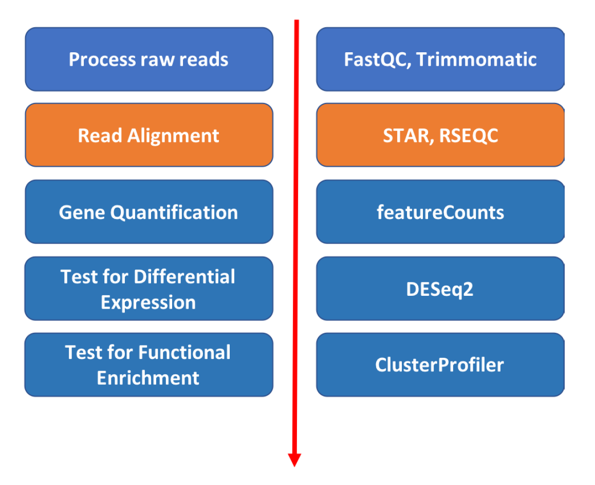

## STAR Aligner

The alignment process consists of choosing an appropriate reference genome to map our reads against and performing the read alignment using one of several splice-aware alignment tools such as STAR or HISAT2. The choice of aligner is often a personal preference and also dependent on the computational resources that are available to you.

[STAR](https://github.com/alexdobin/STAR) is an aligner designed to specifically address many of the challenges of RNA-seq data mapping using a strategy to account for spliced alignments. STAR is shown to have high accuracy and outperforms other aligners by more than a factor of 50 in mapping speed, but it is memory intensive.

STAR algorithm consists of two major steps:
- seed searching step: Find Maximum Mappable Prefixes (MMP) in a read. MMP can be extended by a. mismatches b. indels or c. soft-clipping
- clustering/stitching/scoring step: determine finl read location and deal with a large number of mismatches, indels and splice junctions, as well as scalable with the read length.


More information can be found on the publication: ["STAR: ultrafast universal RNA-seq aligner"](https://academic.oup.com/bioinformatics/article/29/1/15/272537).

Aligning reads using STAR is a two step process:
- Create a genome index
- Map reads to the genome

# Step 1. Build STAR Index for reference genome.
If using the same reference, the index step only needs to be done once.

Tufts HPC hosts genome reference data from UCSC at the following location
```markdown
/cluster/tufts/bio/data/genomes
```
We will need reference files from Saccharomyces_cerevisiae genome version sacCer3, stored here:
```markdown
/cluster/tufts/bio/data/genomes/Saccharomyces_cerevisiae/UCSC/sacCer3/
```

In that directory there are both genome sequence, genome indicies for various aligners, and some annotation data.

We'll re-create the STAR genome index in our own directory in order to practice:

- Get an interaction session on a compute node if you haven't done so

`srun --pty -t 3:00:00  --mem 16G  -N 1 -n 4 bash`

- load the module

`module load STAR/2.7.0a`

- Create a directory to store the index (directory should be created in the top level of the course directory `intro-to-RNA-seq`:

```
mkdir genome
```

- You can take a peak at the first 10 lines of the file `genome.fa` using the `head` command
```
head /cluster/tufts/bio/data/genomes/Saccharomyces_cerevisiae/UCSC/sacCer3/Sequence/WholeGenomeFasta/genome.fa
```

Result below shows an example of FASTA file. Arrows on the right explain format:
```
>chrI                                                          <-- '>' charachter followed by sequence name
CCACACCACACCCACACACCCACACACCACACCACACACCACACCACACC
CACACACACACATCCTAACACTACCCTAACACAGCCCTAATCTAACCCTG
GCCAACCTGTCTCTCAACTTACCCTCCATTACCCTGCCTCCACTCGTTAC
CCTGTCCCATTCAACCATACCACTCCGAACCACCATCCATCCCTCTACTT
ACTACCACTCACCCACCGTTACCCTCCAATTACCCATATCCAACCCACTG             <-- sequence
…
```

- Run STAR index in "genomeGenerate" mode
```
STAR --runMode genomeGenerate --genomeDir ./genome --genomeFastaFiles /cluster/tufts/bio/data/genomes/Saccharomyces_cerevisiae/UCSC/sacCer3/Sequence/WholeGenomeFasta/genome.fa --runThreadN 4
```

The STAR program will start running and show the process as below:
```
Apr 18 17:45:35 ..... started STAR run
Apr 18 17:45:36 ... starting to generate Genome files
Apr 18 17:45:37 ... starting to sort Suffix Array. This may take a long time...
Apr 18 17:45:37 ... sorting Suffix Array chunks and saving them to disk...
Apr 18 17:45:39 ... loading chunks from disk, packing SA...
Apr 18 17:45:39 ... finished generating suffix array
Apr 18 17:45:39 ... generating Suffix Array index
Apr 18 17:45:44 ... completed Suffix Array index
Apr 18 17:45:44 ... writing Genome to disk ...
Apr 18 17:45:44 ... writing Suffix Array to disk ...
Apr 18 17:45:45 ... writing SAindex to disk
Apr 18 17:45:46 ..... finished successfully
```

When it's done, take a look at the files produced by typing `ls genome`:
```
-rw-rw---- 1 whuo01 isberg  107 Apr 18 17:45 chrName.txt
-rw-rw---- 1 whuo01 isberg  122 Apr 18 17:45 chrLength.txt
-rw-rw---- 1 whuo01 isberg  142 Apr 18 17:45 chrStart.txt
-rw-rw---- 1 whuo01 isberg  229 Apr 18 17:45 chrNameLength.txt
-rw-rw---- 1 whuo01 isberg  660 Apr 18 17:45 genomeParameters.txt
-rw-rw---- 1 whuo01 isberg  14M Apr 18 17:45 Genome
-rw-rw---- 1 whuo01 isberg  96M Apr 18 17:45 SA
-rw-rw---- 1 whuo01 isberg 1.5G Apr 18 17:45 SAindex
```

# Step 2. Find gene annotation file.

STAR can use an annotation file gives the location and structure of genes in order to improve alignment in known splice junctions.
Annotation is dynamic and there are at least three major sources of annotation: RefGene, Ensembl, and UCSC.

The intersection among the three sources is shown in the figure below.
RefGene has the fewest unique genes, while more than 50% of genes in Ensembl are unique

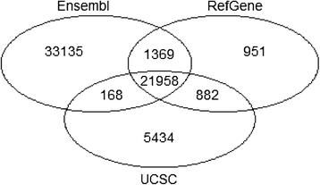

(Figure references [Zhao et al Bioinformatics 2015](https://bmcgenomics.biomedcentral.com/articles/10.1186/s12864-015-1308-8))

It is important to be consistent with your choice of annotation source throughout an analysis.

Tufts HPC hosts genome reference data from various sources.
The annotation information for `sacCer3` from `UCSCC` source can be found at the following location:
```
/cluster/tufts/bio/data/genomes/Saccharomyces_cerevisiae/UCSC/sacCer3/
```

Gene Transfer Format (GTF) is the most widely used file format to store information about gene location and structure with
respect to a given reference genome.

We will use the GTF file located here
```
/cluster/tufts/bio/data/genomes/Saccharomyces_cerevisiae/UCSC/sacCer3/Annotation/Genes
```

An example of the format is shown below, where header line is added for clarity.

| SequenceName | Source           | Feature       | Start | End | Score  | Strand | Frame |  Group  |            |               |            |             |      |         |              |
|--------------|------------------|---------------|-----|-------|--------|-------|-------|---------|------------|---------------|------------|-------------|------|---------|--------------|
| chrI         | sacCer3.genepred | transcript    | 335 | 649   | .      | +     | .     | gene_id | "YAL069W"; | transcript_id | "YAL069W"; |             |      |         |              |
| chrI         | sacCer3.genepred | exon          | 335 | 649   | .      | +     | .     | gene_id | "YAL069W"; | transcript_id | "YAL069W"; | exon_number | "1"; | exon_id | "YAL069W.1"; |
| chrI         | sacCer3.genepred | CDS           | 335 | 646   | .      | +     | 0     | gene_id | "YAL069W"; | transcript_id | "YAL069W"; | exon_number | "1"; | exon_id | "YAL069W.1"; |
| chrI         | sacCer3.genepred | start_codon   | 335 | 337   | .      | +     | 0     | gene_id | "YAL069W"; | transcript_id | "YAL069W"; | exon_number | "1"; | exon_id | "YAL069W.1"; |
| chrI         | sacCer3.genepred | stop_codon    | 647 | 649   | .      | +     | 0     | gene_id | "YAL069W"; | transcript_id | "YAL069W"; | exon_number | "1"; | exon_id | "YAL069W.1"; |

The table shows the location of all types of features in a Gene (transcript, exon, CDS, start_codon, and stop codons)
It also uses the last four columns to provide annotation about the transcript and gene identifiers.

# Step 3. Align.
Let's first check the usage instructions for STAR by typing `STAR`

```
Usage: STAR  [options]... --genomeDir REFERENCE   --readFilesIn R1.fq R2.fq
Spliced Transcripts Alignment to a Reference (c) Alexander Dobin, 2009-2015

### versions
versionSTAR             020201
    int>0: STAR release numeric ID. Please do not change this value!
versionGenome           020101 020200
    int>0: oldest value of the Genome version compatible with this STAR release. Please do not change this value!

### Parameter Files
parametersFiles          -
    string: name of a user-defined parameters file, "-": none. Can only be defined on the command line.

### System
sysShell            -
    string: path to the shell binary, preferably bash, e.g. /bin/bash.
                    - ... the default shell is executed, typically /bin/sh. This was reported to fail on some Ubuntu systems - then you need to specify path to bash.

### Run Parameters
runMode                         alignReads
...
```

Since our alignment command will have multiple arguments, it will be convenient to write a script.

Make a new directory for our results
```markdown
mkdir STAR
```

Open the script ./scripts/star_align_practice.sh in a text editor, for example `nano scripts/star_align_practice.sh`:

```
## Load STAR aligner
module load STAR/2.7.0a
mkdir -p STAR

## Assign the fastq file with its location. Extension with .fastq, .fq and .fastq.gz work the same
FASTQ="raw_data/WT/ERR458493.fastq.gz"

## If you have multiple fastq files for one same sample, you can compile them together by typing below
#FASTQ="reads1.fastq, reads2.fastq"

## Name the output file
OUT="WT_ERR458493"

## Defing reference genome directory
REF_DIR="/cluster/tufts/bio/data/genomes/Saccharomyces_cerevisiae/UCSC/sacCer3"

## execute STAR in the runMode "alignReads"
STAR --genomeDir ${REF_DIR}/Sequence/STAR \
--readFilesIn ${FASTQ} \
--readFilesCommand zcat \
--outFileNamePrefix STAR/${OUT}_ \
--outFilterMultimapNmax 1 \
--outSAMtype BAM SortedByCoordinate \
--runThreadN 4 \
--alignIntronMin 1 \
--alignIntronMax 2500 \
--sjdbGTFfile ${REF_DIR}/Annotation/Genes/sacCer3.gtf \
--sjdbOverhang 49
```
We have defined the following variables for convenience:
- `FASTQ` to store the comma-separated list of names and locations of all input files for this sample
- `OUT` to store the name of our output files
- `REF_DIR` in order to give the location of the reference data.

We've given the following arguments to `STAR`:
1. `--outFileNamePrefix`: specify output folder and prefix of the names
2. `--outFilterMultimapNmax 1`: max number of multiple alignments allowed for a read: if exceeded, the read is considered unmapped. Here it is set to 1.
3. `--outSAMtype BAM SortedByCoordinate`:  output sorted by coordinate Aligned.sortedByCoord.out.bam file, similar to samtools sort command
4. `--runThreadsN 4`: STAR runs four parallel threads. Alignment is a task that is easy to parallelize because alignment of a read is independent of other reads.
5. `--alignIntronMin/Max`: Minimal and Maximal intron length
6. `--sjdbGTFfile" `: GTF annotation file for the gene expression calculation
7. `--sjdbOverhang`:  specifies the length of the genomic sequence around the annotated junction to be used in constructing the splice junctions database. Ideally, this length should be equal to the ReadLength-1, where ReadLength is the length of the reads. For instance, for Illumina 2x100b paired-end reads, the ideal value is 100-1=99. In case of reads of varying length, the ideal value is max(ReadLength)-1. In most cases, the default value of 100 will work as well as the ideal value.

Exit nano by typing `^X`.

Now we can run our script using sh.
```
sh ./scripts/star_align_practice.sh
```
Result:
```
(base) [whuo01@m4lmem01 intro-to-RNA-seq]$ sh ./scripts/star_align_practice.sh
May 21 13:11:07 ..... started STAR run
May 21 13:11:07 ..... loading genome
May 21 13:11:09 ..... processing annotations GTF
May 21 13:11:09 ..... inserting junctions into the genome indices
May 21 13:11:17 ..... started mapping
May 21 13:11:28 ..... started sorting BAM
May 21 13:11:29 ..... finished successfully
```

# Step 4. View results.

View result by typing in:
`ls -lh STAR/`
```markdown
(base) [whuo01@m4lmem01 intro-to-RNA-seq]$ ls -lh STAR/
total 46M
-rw-rw---- 1 whuo01 isberg  46M May 21 13:11 WT_ERR458493_Aligned.sortedByCoord.out.bam
-rw-rw---- 1 whuo01 isberg 1.8K May 21 13:11 WT_ERR458493_Log.final.out
-rw-rw---- 1 whuo01 isberg  21K May 21 13:11 WT_ERR458493_Log.out
-rw-rw---- 1 whuo01 isberg  246 May 21 13:11 WT_ERR458493_Log.progress.out
-rw-rw---- 1 whuo01 isberg  14K May 21 13:11 WT_ERR458493_SJ.out.tab
drwx--S--- 2 whuo01 isberg 4.0K May 21 13:11 WT_ERR458493__STARgenome
```
The file `WT_ERR458493_Log.final.out` will give us a summary of the run. Take a look at the summary by running:
`cat STAR/WT_ERR458493_Log.final.out`

```
(base) [whuo01@m4lmem01 intro-to-RNA-seq]$ cat STAR/WT_ERR458493_Log.final.out
                                 Started job on |       May 21 13:11:07
                             Started mapping on |       May 21 13:11:17
                                    Finished on |       May 21 13:11:29
       Mapping speed, Million of reads per hour |       328.19

                          Number of input reads |       1093957
                      Average input read length |       51
                                    UNIQUE READS:
                   Uniquely mapped reads number |       938174
                        Uniquely mapped reads % |       85.76%
                          Average mapped length |       50.75
                       Number of splices: Total |       8681
            Number of splices: Annotated (sjdb) |       7530
                       Number of splices: GT/AG |       8002
                       Number of splices: GC/AG |       9
                       Number of splices: AT/AC |       0
               Number of splices: Non-canonical |       670
                      Mismatch rate per base, % |       0.37%
                         Deletion rate per base |       0.00%
                        Deletion average length |       0.00
                        Insertion rate per base |       0.00%
                       Insertion average length |       1.05
                             MULTI-MAPPING READS:
        Number of reads mapped to multiple loci |       0
             % of reads mapped to multiple loci |       0.00%
        Number of reads mapped to too many loci |       123562
             % of reads mapped to too many loci |       11.29%
                                  UNMAPPED READS:
       % of reads unmapped: too many mismatches |       0.00%
                 % of reads unmapped: too short |       2.91%
                     % of reads unmapped: other |       0.04%
                                  CHIMERIC READS:
                       Number of chimeric reads |       0
                            % of chimeric reads |       0.00%                                
```

For well annotated genomes, it's expected that >75% of the reads to be uniquely mapped and
that most splice junctions are annotated.
Further QC options are available with `RSEQC` and `samtools` packages (see scripts/bamqc.sh).


# Step 5. Create index for BAM file.
- **Bam format**

The BAM file is a binary compressed version of a Sequence Alignment Map (SAM) file.
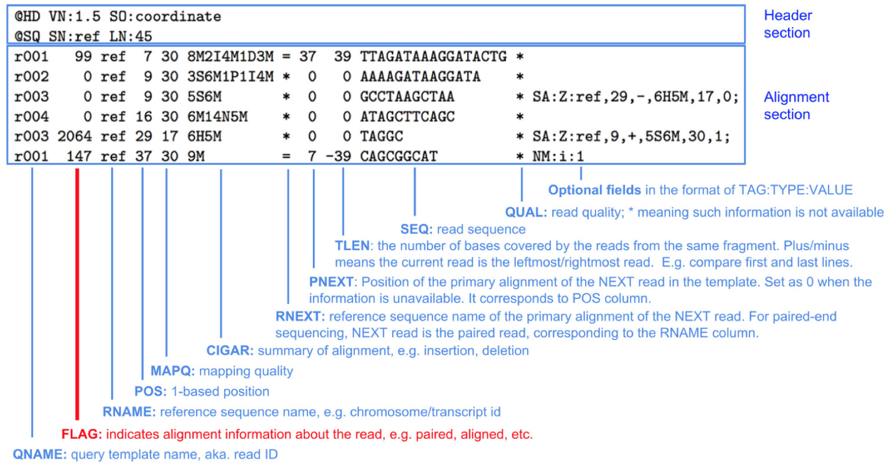

Take a look at the output file:
```markdown
module load samtools/1.9
samtools view -h STAR/WT_ERR458493_Aligned.sortedByCoord.out.bam | less
```
Press `space` to scroll down to the file, and press `q` to exit viewing the file. The file has two sections:

Header:
```markdown
@HD VN:1.4 SO:coordinate          <-- Format version (VN) and Sorting order of alignments (SO)
@SQ SN:chrI LN:230218             <-- Reference sequence name (SN) and length (LN)
...
```

Alignment:
```markdown
ERR458493.243111  0 chrI 3873 255 51M * 0 0 TGAAAATATTCTGAGGTAAAAGCCATTAAGGTCCAGATAACCAAGGGACAA     <-- Template name, FLAG, reference name, mapping position (start), mapping quality, CIGAR string, reference name of the paired read, position of the paired read, template length, read sequence
...
```
FLAG: The FLAG field is displayed as a single integer, but is the sum of bitwise flags to denote multiple attributes of a read alignment. For example, 16 means the read being reverse complemented.
CIGAR: Concise Idiosyncratic Gapped Alignment Report (CIGAR) string. For example: M represents an alignment match

More information on BAM format: [samtools on github](https://samtools.github.io/hts-specs/SAMv1.pdf) and [wikipedia: SAM_(file_format)](https://en.wikipedia.org/wiki/SAM_(file_format)).

- **Create index for BAM file**

In order to visualize our BAM file in IGV (or any other visualization tool, such as Geneious) we will need a BAM index. This enables fast searching and display.

We'll generate one using `samtools`.

```
module load samtools/1.9
samtools index STAR/WT_ERR458493_Aligned.sortedByCoord.out.bam
```

The result is a file with the extension `bai` in the same folder as our BAM file:
```
WT_ERR458493_Aligned.sortedByCoord.out.bam.bai
```

## Visualizing reads using IGV
- Return to On Demand Dashboard tab:
`https://ondemand.cluster.tufts.edu`

- On the top grey menu bar, choose
`Interactive Apps->IGV`

- Set the following parameters:
```
hours: 1
cores: 4
memory: 64 Gb
directory: < leave default >`
```

- Click: `Launch`

- Click: `Launch noVNC in New Tab` when it appears.

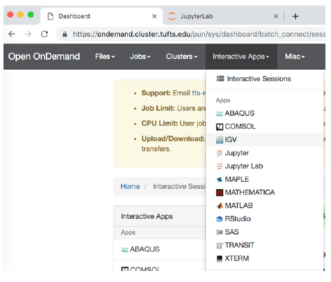

- If the genome browser is cut off, resize using Chrome:

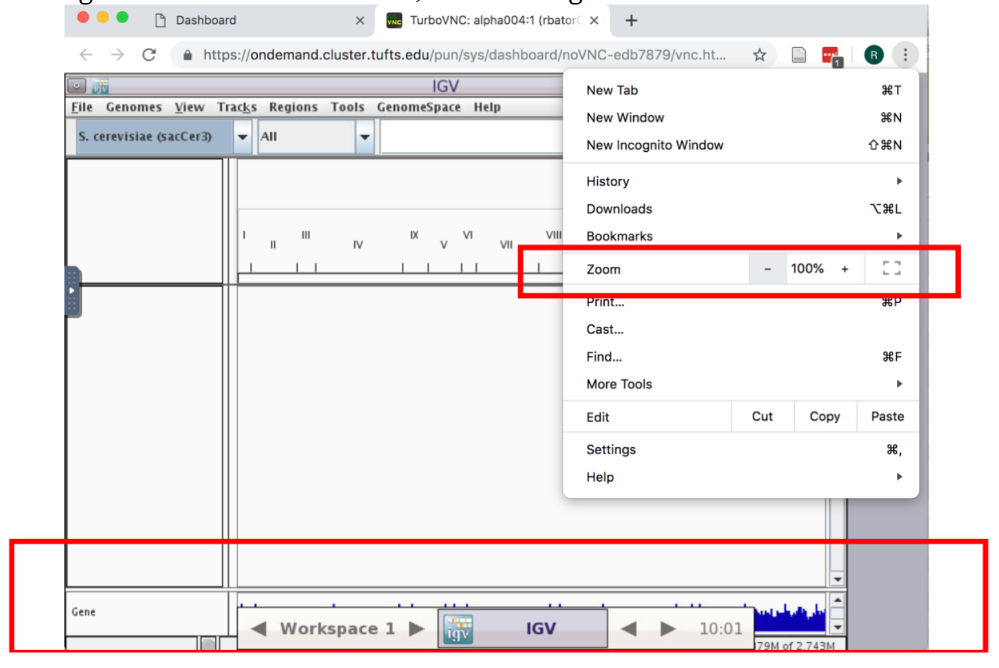

- Enable RNA-seq-specific Splice Junction track by making the following selections in the IGV menu:
  1. `View -> Preferences`

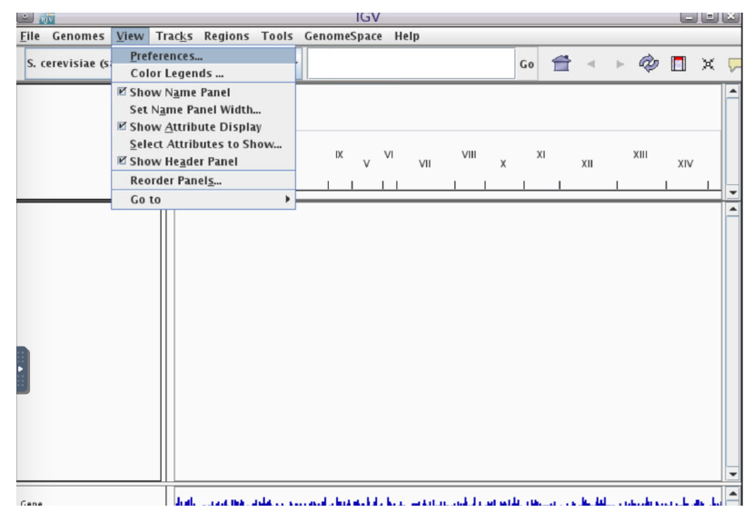

  2.`Alignments -> Track Display Options -> Splice Junction Track -> OK`

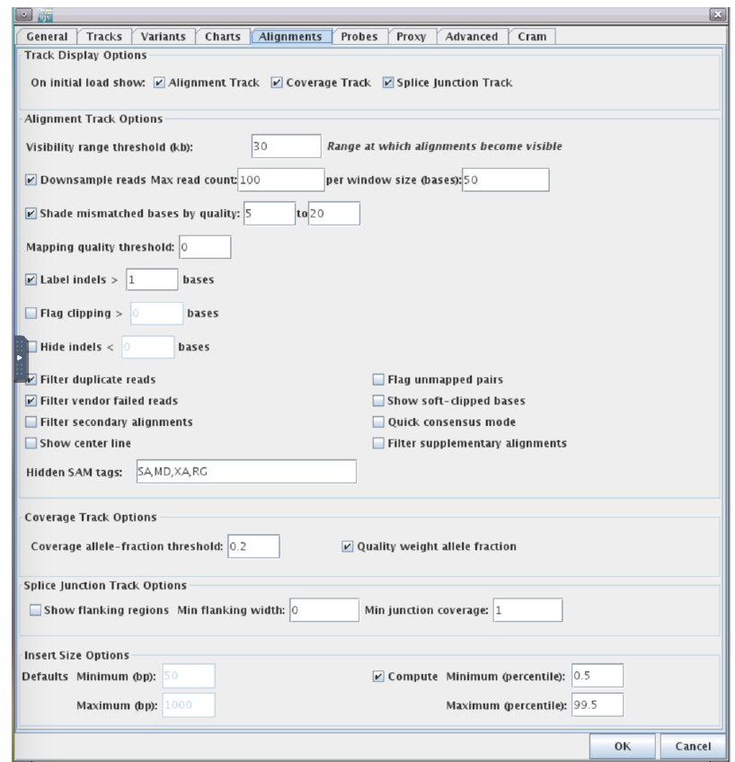

- Choose reference genome by clicking the `Genomes` menu and selecting `Load Genome from Server...`

- Scroll down to `Sacromyces ceerevicea (sacCer3)` -> leave `Download Sequence` UNchecked -> click `OK`

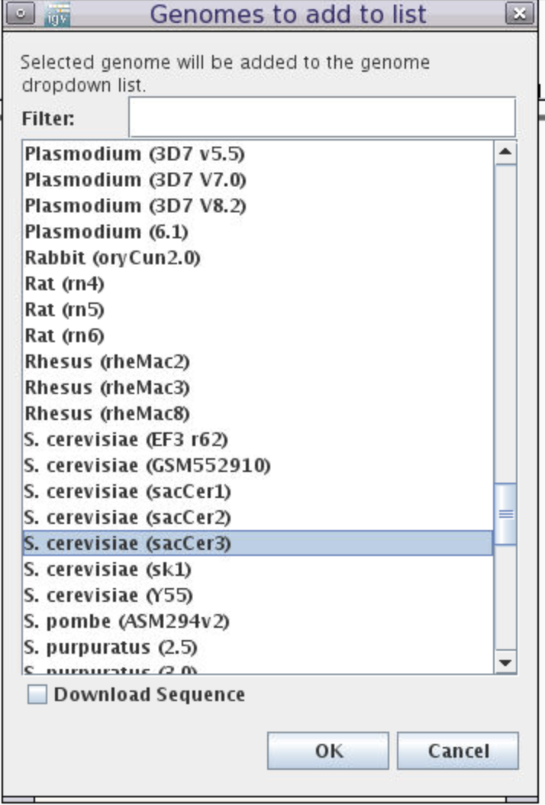

- Load BAM file:

Click `File-> Load from File`
Choose the sorted and indexed BAM files we generated:
`/cluster/tufts/bio/tools/training/users/YOUR_USERNAME/intro-to-RNA-seq/STAR/WT_ERR458493_Aligned.sortedByCoord.out.bam`

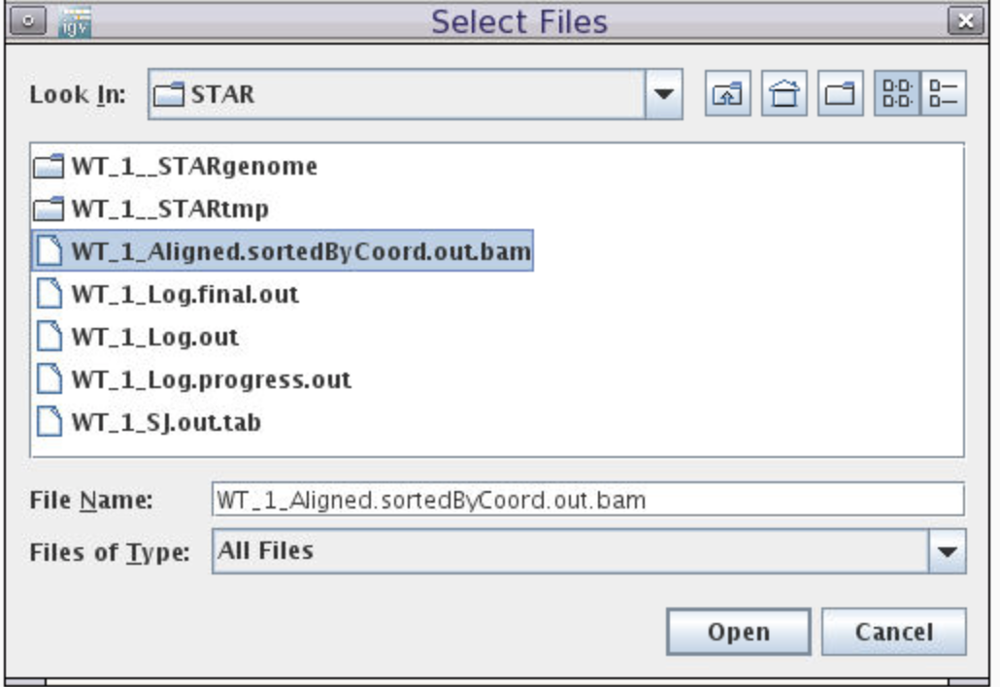

In the genome coordinate box (shown below) type the gene name `SUS1`.
We can see that another name of this gene is `YBR111W-A`.

Here is a summary of the fields and tracks present in IGV:

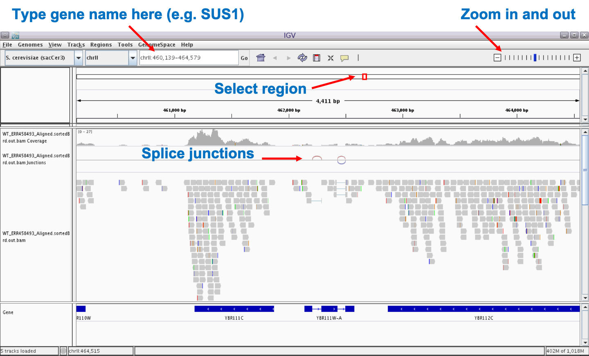

If we zoom in on the `YBR111W-A` gene, we see in the `Gene` track at the bottom that the gene contains two introns.
We see in the `BAM` track that reads are spiced across the introns and that coverage track that read coverage in the area of the intron is missing as expected.  


## Process all samples: Align all reads from two conditions (WT and SNF2)

In the previous steps, we learned how to do quality control and read alignment using one WT fastq file as an example.
Here, before we continue to the next step, we wanted to do the same procedure for all samples in both WT and SNF2 conditions so that we can performed the differential expression analysis.
You can do so manually by creating a new version of the script `./scripts/star_align_practice.sh` for each sample.

This can be done by creating a copy of the script, e.g.:
```
cp ./scripts/star_align_practice.sh ./scripts/star_align_ERR458500.sh
```
Then, change the name of the input `FASTQ` and output `OUT` to match the sample you are aligning, e.g. by using `nano ./scripts/star_align_ERR458500.sh` to create the modified lines:
```
## Fastq files to align, separated by commas for multiple lanes of a single sample
FASTQ="raw_data/SNF2/ERR458500.fastq.gz"

## Name the output file
OUT="SNF2_ERR458500"
```
Exit by pressing Crtl and X and save the file by entering Y when prompt. Finally, run `sh ./scripts/star_align_ERR458500.sh`.
Eventually, we want to align 7 WT samples and 7 SNF2 samples individually and generate 14 bam files in total.

We have also prepared a script that will align all reads individually in a automatic manner.

In order to use our pre-written scripts, first make sure you have an interaction session on a compute node by typing:
`srun --pty -t 3:00:00  --mem 16G  -N 1 -n 4 bash`

Note: If wait times are very long, you can try a different partitions by adding, e.g. `-p interactive` before bash.

After you get an interactive session, run the following commands:
```
sh ./scripts/star_align_individual.sh
```

This step will automatically align individual fastq files to reference and use samtools to create indexes. This step will take about 15-30min to finish.

After the alignment is finished, type in
`tree ./STAR`
 and you will see the aligned reads in STAR folder:
 ```
 [whuo01@pcomp45 intro-to-RNA-seq]$ tree STAR                       <--command
STAR                                                                <--folder name: STAR
├── SNF2_ERR458500_Aligned.sortedByCoord.out.bam                    <--Aligned bam file for SNF2 sample ERR458500
├── SNF2_ERR458500_Aligned.sortedByCoord.out.bam.bai                <--Indexed bam.bai file
├── SNF2_ERR458500_Log.final.out                                    <--Alignment statistics
├── SNF2_ERR458500_Log.out                                          <--STAR alignment setting
├── SNF2_ERR458500_Log.progress.out
├── SNF2_ERR458500_SJ.out.tab
├── SNF2_ERR458500__STARgenome
│   ├── exonGeTrInfo.tab
│   ├── exonInfo.tab
│   ├── geneInfo.tab
│   ├── sjdbInfo.txt
│   ├── sjdbList.fromGTF.out.tab
│   ├── sjdbList.out.tab
│   └── transcriptInfo.tab
...
├── WT_ERR458494_Aligned.sortedByCoord.out.bam                    <--Aligned bam file for WT sample ERR458494
├── WT_ERR458494_Aligned.sortedByCoord.out.bam.bai                <--Indexed bam.bai file
├── WT_ERR458494_Log.final.out
├── WT_ERR458494_Log.out
├── WT_ERR458494_Log.progress.out
├── WT_ERR458494_SJ.out.tab
├── WT_ERR458494__STARgenome
│   ├── exonGeTrInfo.tab
│   ├── exonInfo.tab
│   ├── geneInfo.tab
│   ├── sjdbInfo.txt
│   ├── sjdbList.fromGTF.out.tab
│   ├── sjdbList.out.tab
│   └── transcriptInfo.tab
...
```

## Optional step. Visualize number of mapped reads v.s. unmapped reads in all samples using barplot
To visualize the result, type:
```
module load R/3.5.0
Rscript ./scripts/mapping_percentage.R
```
If ran successfully, you will see the message below:
```
[1] "Processing file:  SNF2_ERR458500_Log.final.out"
[1] "Processing file:  SNF2_ERR458501_Log.final.out"
[1] "Processing file:  SNF2_ERR458502_Log.final.out"
[1] "Processing file:  SNF2_ERR458503_Log.final.out"
[1] "Processing file:  SNF2_ERR458504_Log.final.out"
[1] "Processing file:  SNF2_ERR458505_Log.final.out"
[1] "Processing file:  SNF2_ERR458506_Log.final.out"
[1] "Processing file:  WT_ERR458493_Log.final.out"
[1] "Processing file:  WT_ERR458494_Log.final.out"
[1] "Processing file:  WT_ERR458495_Log.final.out"
[1] "Processing file:  WT_ERR458496_Log.final.out"
[1] "Processing file:  WT_ERR458497_Log.final.out"
[1] "Processing file:  WT_ERR458498_Log.final.out"
[1] "Processing file:  WT_ERR458499_Log.final.out"
null device
          1
```
This code will generate a pdf file named `Mapping_stat.pdf`.


Now you are ready for the next step.

## Summary

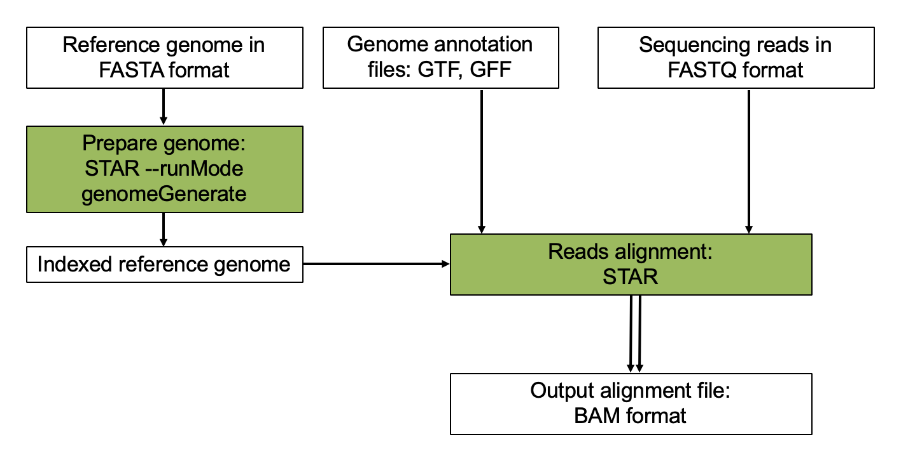

## Workshop Schedule
- [Course Home](../README.md)
- [Introduction](slides/RNAseq_intro_RB_28May20.pdf)
- [Setup using Tufts HPC](01_Setup.md)
- [Process Raw Reads](02_Quality_Control.md)
- Currently at: Read Alignment
- Next: [Gene Quantification](04_Gene_Quantification.md)
- [Differential Expression](05_Differential_Expression.md)
- [Pathway Enrichment](06_Pathway_Enrichment.md)
