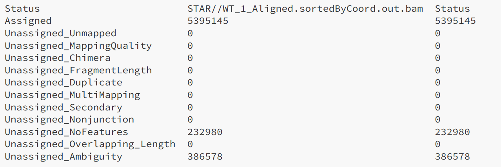
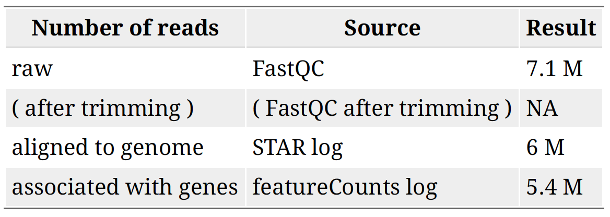

Approximate time: 20 minutes

## Learning Objectives

- Use Subread to perform feature counts for each gene


## Counting reads: featureCounts

The mapped coordinates of each read are compared with the features in the GTF file. Reads that overlap with a gene by >=1 bp are counted as belonging to that feature. Ambiguous reads will be discarded and the output will be a matrix of genes and samples.


By default featurecounts will 1) count reads in features labeled as 'exon' in the GTF and 2) group all exons with a given 'gene_id'. An example of a transcript with multiple exons:


## Counting reads: running the script

Open into-to-RNA-seq/scripts/featurecounts.sh in Jupyter Lab text editor or `vi` editor:
```markdown
#!/bin/bash

## load subread module
module load subread/1.6.3

## create output directory
mkdir featurecounts

## reference directory
REF_DIR=/cluster/tufts/bio/data/genomes/Saccharomyces_cerevisiae/UCSC/sacCer3

## Run featurecounts
featureCounts \
-a ${REF_DIR}/Annotation/Genes/sacCer3.gtf \
-o featurecounts/featurecounts_results.txt \
STAR/*bam
```

To run the script, type in:
```markdown
./scripts/featurecounts.sh
```

The output files will contain results and results summary.
```markdown
featurecounts/
├── featurecounts_results.txt
└── featurecounts_results.txt.summary
```

## Counting reads: results
To look at the result, type in
```markdown
cat featurecounts/featurecounts_results.txt.summary | column -t
```




## Tracking read numbers
As the analysis progresses you should keep track of the following:




[Previous: Read Alignment ](03_Read_Alignment.md)

[Next: Differential Expression](05_Differential_Expression.md)
