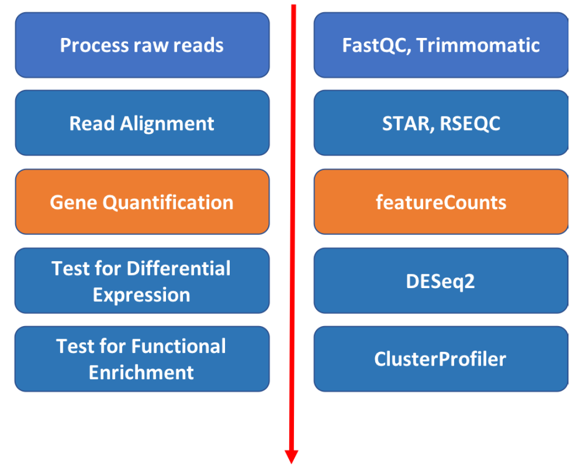
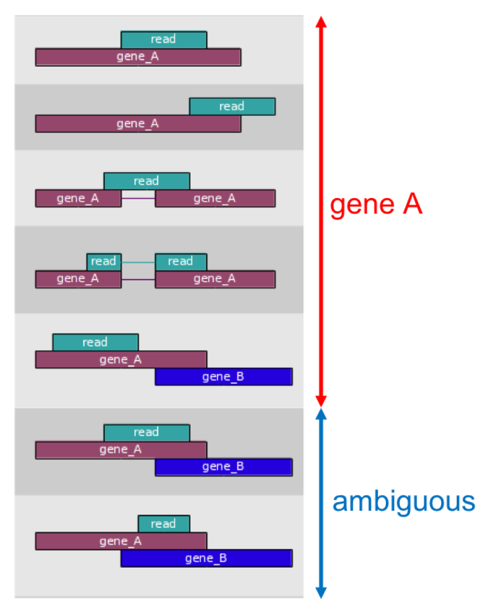
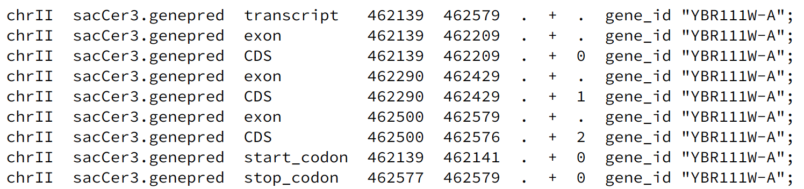
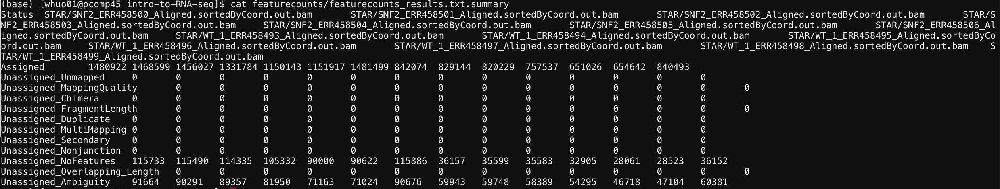
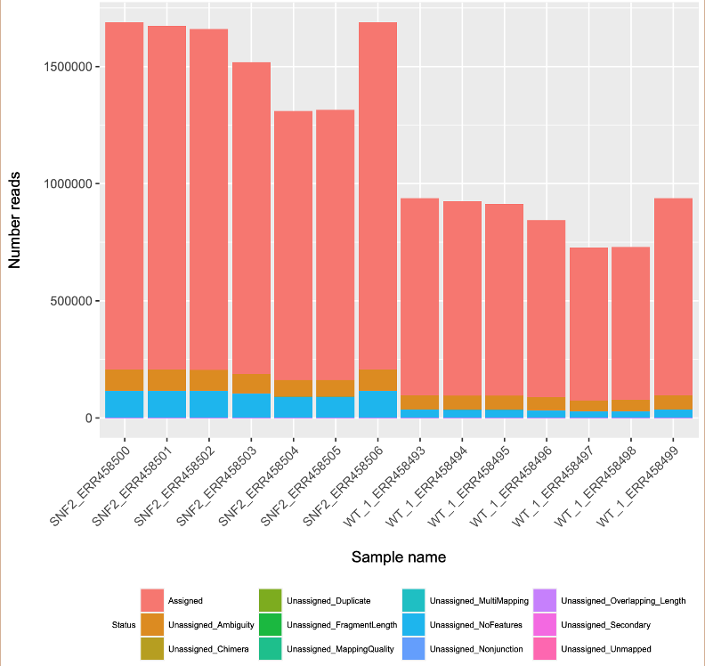
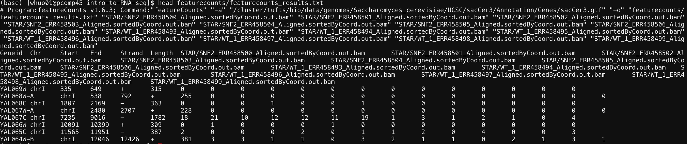

## Gene quantification

Approximate time: 20 minutes

## Learning Objectives

- Use the `featureCounts` function from the `Subread` package to perform feature quantification



## Introduction to featureCounts

The mapped coordinates of each read are compared with the features in the GTF file.
Reads that overlap with a gene by >=1 bp are counted as belonging to that feature.
Ambiguous reads will be discarded and the output will be a matrix of genes and samples.



By default featurecounts will
1) count reads in features labeled as 'exon' in the GTF and
2) group all exons with a given 'gene_id'.

An example of a transcript with multiple exons:



## Step 1: write and run the script
Get an interaction session on a compute node by typing:
`srun --pty -t 3:00:00  --mem 16G  -N 1 -n 4 bash`

Create a new script called `featureccounts.sh` using the `nano` text editor `nano featurecounts.sh` and enter the following
content:

```
## load subread module
module load subread/1.6.3

## create output directory
mkdir -p featurecounts

## reference directory
REF_DIR=/cluster/tufts/bio/data/genomes/Saccharomyces_cerevisiae/UCSC/sacCer3

## Run featurecounts
featureCounts \
-a ${REF_DIR}/Annotation/Genes/sacCer3.gtf \
-o featurecounts/featurecounts_results.txt \
STAR/*bam
```

Exit editor by typing `Control and X` and `Y` to save.

To run the script, type in:
```
sh featurecounts.sh
```
If your script failed to run, try to run our prepared scripts by typing `sh scripts/featurecounts.sh`.  

Result:
```
(base) [whuo01@pcomp45 intro-to-RNA-seq]$ sh ./scripts/featurecounts.sh

        ==========     _____ _    _ ____  _____  ______          _____  
        =====         / ____| |  | |  _ \|  __ \|  ____|   /\   |  __ \
          =====      | (___ | |  | | |_) | |__) | |__     /  \  | |  | |
            ====      \___ \| |  | |  _ <|  _  /|  __|   / /\ \ | |  | |
              ====    ____) | |__| | |_) | | \ \| |____ / ____ \| |__| |
        ==========   |_____/ \____/|____/|_|  \_\______/_/    \_\_____/
          v1.6.3

//========================== featureCounts setting ===========================\\
||                                                                            ||
||             Input files : 14 BAM files                                     ||
||                           S SNF2_ERR458500_Aligned.sortedByCoord.out.bam   ||
||                           S SNF2_ERR458501_Aligned.sortedByCoord.out.bam   ||
||                           S SNF2_ERR458502_Aligned.sortedByCoord.out.bam   ||
||                           S SNF2_ERR458503_Aligned.sortedByCoord.out.bam   ||
||                           S SNF2_ERR458504_Aligned.sortedByCoord.out.bam   ||
||                           S SNF2_ERR458505_Aligned.sortedByCoord.out.bam   ||
||                           S SNF2_ERR458506_Aligned.sortedByCoord.out.bam   ||
||                           S WT_ERR458493_Aligned.sortedByCoord.out.bam   ||
||                           S WT_ERR458494_Aligned.sortedByCoord.out.bam   ||
||                           S WT_ERR458495_Aligned.sortedByCoord.out.bam   ||
||                           S WT_ERR458496_Aligned.sortedByCoord.out.bam   ||
||                           S WT_ERR458497_Aligned.sortedByCoord.out.bam   ||
||                           S WT_ERR458498_Aligned.sortedByCoord.out.bam   ||
||                           S WT_ERR458499_Aligned.sortedByCoord.out.bam   ||
||                                                                            ||
||             Output file : featurecounts_results.txt                        ||
||                 Summary : featurecounts_results.txt.summary                ||
||              Annotation : sacCer3.gtf (GTF)                                ||
||      Dir for temp files : featurecounts                                    ||
||                                                                            ||
||                 Threads : 1                                                ||
||                   Level : meta-feature level                               ||
||              Paired-end : no                                               ||
||      Multimapping reads : not counted                                      ||
|| Multi-overlapping reads : not counted                                      ||
||   Min overlapping bases : 1                                                ||
||                                                                            ||
\\===================== http://subread.sourceforge.net/ ======================//

//================================= Running ==================================\\
||                                                                            ||
|| Load annotation file sacCer3.gtf ...                                       ||
||    Features : 7050                                                         ||
||    Meta-features : 6692                                                    ||
||    Chromosomes/contigs : 17                                                ||
||                                                                            ||
|| Process BAM file SNF2_ERR458500_Aligned.sortedByCoord.out.bam...           ||
||    Single-end reads are included.                                          ||
||    Assign alignments to features...                                        ||
||    Total alignments : 1688319                                              ||
||    Successfully assigned alignments : 1480922 (87.7%)                      ||
||    Running time : 0.03 minutes                                             ||
||                                                                            ||
|| Process BAM file SNF2_ERR458501_Aligned.sortedByCoord.out.bam...           ||
||    Single-end reads are included.                                          ||
||    Assign alignments to features...                                        ||
||    Total alignments : 1674380                                              ||
||    Successfully assigned alignments : 1468599 (87.7%)                      ||
||    Running time : 0.03 minutes                                             ||
||                                                                            ||
|| Process BAM file SNF2_ERR458502_Aligned.sortedByCoord.out.bam...           ||
||    Single-end reads are included.                                          ||
||    Assign alignments to features...                                        ||
||    Total alignments : 1659719                                              ||
||    Successfully assigned alignments : 1456027 (87.7%)                      ||
||    Running time : 0.03 minutes                                             ||
||                                                                            ||
|| Process BAM file SNF2_ERR458503_Aligned.sortedByCoord.out.bam...           ||
||    Single-end reads are included.                                          ||
||    Assign alignments to features...                                        ||
||    Total alignments : 1519066                                              ||
||    Successfully assigned alignments : 1331784 (87.7%)                      ||
||    Running time : 0.02 minutes                                             ||
||                                                                            ||
|| Process BAM file SNF2_ERR458504_Aligned.sortedByCoord.out.bam...           ||
||    Single-end reads are included.                                          ||
||    Assign alignments to features...                                        ||
||    Total alignments : 1311306                                              ||
||    Successfully assigned alignments : 1150143 (87.7%)                      ||
||    Running time : 0.02 minutes                                             ||
||                                                                            ||
|| Process BAM file SNF2_ERR458505_Aligned.sortedByCoord.out.bam...           ||
||    Single-end reads are included.                                          ||
||    Assign alignments to features...                                        ||
||    Total alignments : 1313563                                              ||
||    Successfully assigned alignments : 1151917 (87.7%)                      ||
||    Running time : 0.02 minutes                                             ||
||                                                                            ||
|| Process BAM file SNF2_ERR458506_Aligned.sortedByCoord.out.bam...           ||
||    Single-end reads are included.                                          ||
||    Assign alignments to features...                                        ||
||    Total alignments : 1688061                                              ||
||    Successfully assigned alignments : 1481499 (87.8%)                      ||
||    Running time : 0.03 minutes                                             ||
||                                                                            ||
|| Process BAM file WT_ERR458493_Aligned.sortedByCoord.out.bam...           ||
||    Single-end reads are included.                                          ||
||    Assign alignments to features...                                        ||
||    Total alignments : 938174                                               ||
||    Successfully assigned alignments : 842074 (89.8%)                       ||
||    Running time : 0.02 minutes                                             ||
||                                                                            ||
|| Process BAM file WT_ERR458494_Aligned.sortedByCoord.out.bam...           ||
||    Single-end reads are included.                                          ||
||    Assign alignments to features...                                        ||
||    Total alignments : 924491                                               ||
||    Successfully assigned alignments : 829144 (89.7%)                       ||
||    Running time : 0.02 minutes                                             ||
||                                                                            ||
|| Process BAM file WT_ERR458495_Aligned.sortedByCoord.out.bam...           ||
||    Single-end reads are included.                                          ||
||    Assign alignments to features...                                        ||
||    Total alignments : 914201                                               ||
||    Successfully assigned alignments : 820229 (89.7%)                       ||
||    Running time : 0.01 minutes                                             ||
||                                                                            ||
|| Process BAM file WT_ERR458496_Aligned.sortedByCoord.out.bam...           ||
||    Single-end reads are included.                                          ||
||    Assign alignments to features...                                        ||
||    Total alignments : 844737                                               ||
||    Successfully assigned alignments : 757537 (89.7%)                       ||
||    Running time : 0.01 minutes                                             ||
||                                                                            ||
|| Process BAM file WT_ERR458497_Aligned.sortedByCoord.out.bam...           ||
||    Single-end reads are included.                                          ||
||    Assign alignments to features...                                        ||
||    Total alignments : 725805                                               ||
||    Successfully assigned alignments : 651026 (89.7%)                       ||
||    Running time : 0.01 minutes                                             ||
||                                                                            ||
|| Process BAM file WT_ERR458498_Aligned.sortedByCoord.out.bam...           ||
||    Single-end reads are included.                                          ||
||    Assign alignments to features...                                        ||
||    Total alignments : 730269                                               ||
||    Successfully assigned alignments : 654642 (89.6%)                       ||
||    Running time : 0.01 minutes                                             ||
||                                                                            ||
|| Process BAM file WT_ERR458499_Aligned.sortedByCoord.out.bam...           ||
||    Single-end reads are included.                                          ||
||    Assign alignments to features...                                        ||
||    Total alignments : 937026                                               ||
||    Successfully assigned alignments : 840493 (89.7%)                       ||
||    Running time : 0.02 minutes                                             ||
||                                                                            ||
||                                                                            ||
|| Summary of counting results can be found in file "featurecounts/featureco  ||
|| unts_results.txt.summary"                                                  ||
||                                                                            ||
\\===================== http://subread.sourceforge.net/ ======================//
```

The output files will contain results and results summary.
```
featurecounts/
├── featurecounts_results.txt
└── featurecounts_results.txt.summary
```

## Step 2: View the summary statistics
To look at the summary statistics, type:
```
cat featurecounts/featurecounts_results.txt.summary
```

Result:



The top line is the column names for this table. They are the name of each individule aligned file. The left most line is the row names, or the statistics of the alignment. From the table, we see that most of the reads fall within "assigned" features, meaning most of the aligned reads were transformed into gene expression value.

## Optional step. Visualize number of assigned reads in all samples using barplot.
To visualize the result, type:
```
module load R/3.5.0
Rscript ./scripts/featurecount_stat.R
```
If ran successfully, you will see the message below:
```
null device
          1
```
This code will generate a pdf file named `Featurecount_stat.pdf`.




## Step 3: View the feature count result
To take a look at the calculated feature count, type:
```
head featurecounts/featurecounts_results.txt
```
Here, we are only looking at the top 10 lines in the featurecounts_results.txt file using `head` command.
Result:



The very top line started with # shows the command that was used to run featurecount. Starting on the second line, it shows a table with sample names as column names and transcript names as row names. Each cell within the table shows how many reads from a sample were assigned to that transcript.

You will notice the sample names are too long and contained unwanted strings. In order clean the file further for the DESeq2 analysis, we run the below command:
```
cat featurecounts/featurecounts_results.txt |sed "2s/STAR\///g" | sed "2s/\_Aligned.sortedByCoord.out.bam//g" > featurecounts/featurecounts_results.mod.txt
```
This line of command will modify the column names to simplified names. Now you are ready for the next step.

## Workshop Schedule
- [Course Home](../README.md)
- [Introduction](slides/RNAseq_intro_RB_28May20.pdf)
- [Setup using Tufts HPC](01_Setup.md)
- [Process Raw Reads](02_Quality_Control.md)
- [Read Alignment](03_Read_Alignment.md)
- Currently at: Gene Quantification
- Next: [Differential Expression](05_Differential_Expression.md)
- [Pathway Enrichment](06_Pathway_Enrichment.md)
