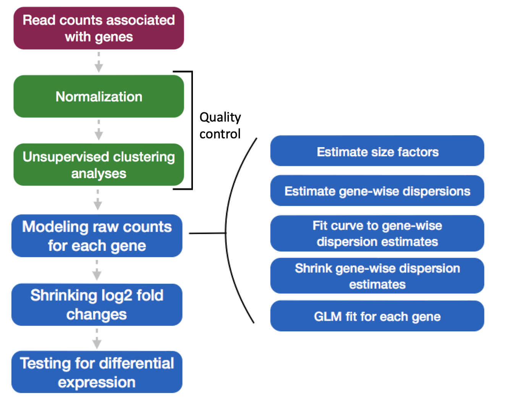
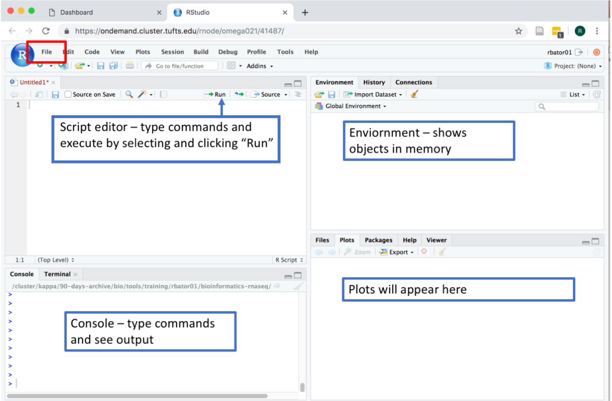
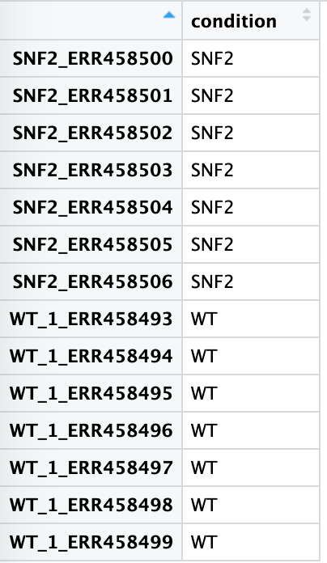
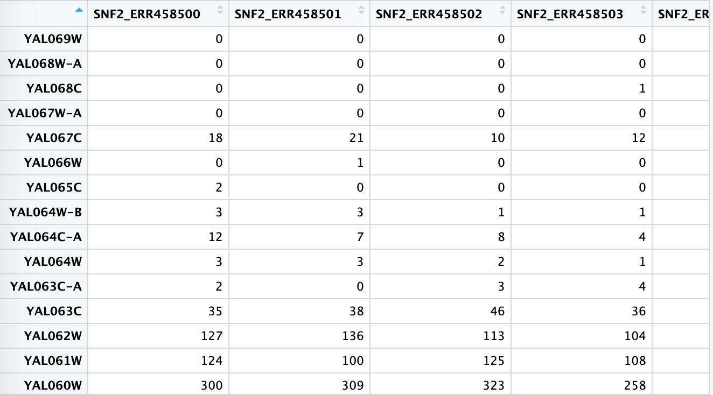
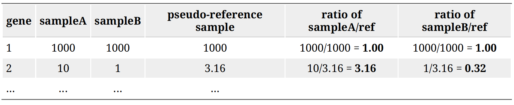
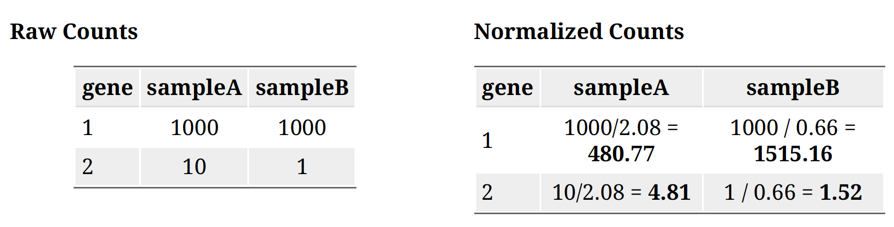
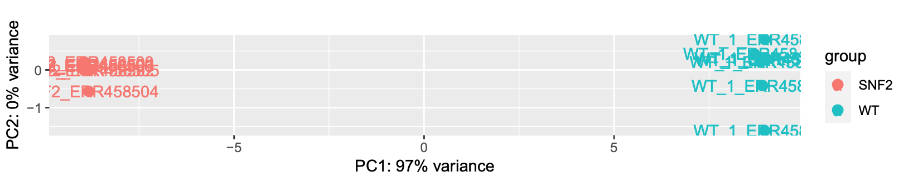
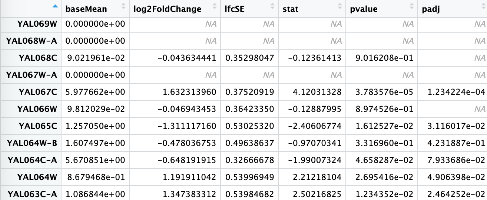
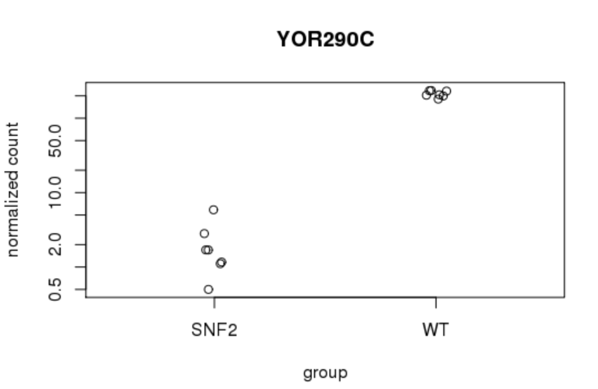

Approximate time: 60 minutes

## Learning Objectives

- Use R to perform differential expression analysis



## Rstudio on the Tufts HPC cluster via "On Demand"
1. Open a Chrome browser and visit [ondemand.cluster.tufts.edu](ondemand.cluster.tufts.edu)
2. Log in with your Tufts Credentials
3. On the top menu bar choose Interactive Apps -> Rstudio

4. Choose:
```markdown
Number of hours: 4
Number of cores: 1
Amount of Memory: 32 Gb
R version: 3.5.0
```

## Rstudio Interface
Go to the File menu -> New File -> R Script, you should see:



To save current session, click: File menu -> Save your file as intro.R

## Rstudio: Set up working directory and library
To run the code in the script editor, select a single line of code or highlight a block of code and click "Run".
To see your current working directory:
```markdown
getwd()
```
To change to our workshop directory:
```markdown
setwd('~/into-to-RNA-seq/')
```

Check which paths on the cluster R will use to find library locations:
```markdown
.libPaths()
```
Since we will be using a lot of R libraries today for differential expression analysis, instead of installing these libraries, you can use common library from Tufts bio tools by running:
```markdown
.libPaths('/cluster/tufts/bio/tools/R_libs/3.5')
```
Now, you will be able to use all the libraries needed for this course. To load a library, type:
```markdown
library(tidyverse)
```

## Rstudio: Read in Data
To read in the metadata for our experiment:
```markdown
meta <- read.table("data/sample_info.txt", header=TRUE)
```

You can view the data by typing `meta` or `view(meta)`


Load preprocessed data set of 7 WT replicates and 7 SNF2 knockouts
```markdown
feature_count <- read.table("./featurecounts/featurecounts_results.mod.txt",
                            header=TRUE, row.names = 1)
# remove first 6 columns by select the column 6 to 19
data <- feature_count[,6:19]
view(data)
```

Similarly, you can view the data by typing `data` or `view(data)`


## DESeq2: Create DESeq2 Dataset object
Before running DESeq2, load all required libraries by running below:
```markdown
# Put HPC biotools R libraries on your R path
.libPaths(c('', '/cluster/tufts/bio/tools/R_libs/3.5/'))
# load required libraries
library(DESeq2)
library(vsn)
library(ggplot2)
library(dplyr)
library(tidyverse)
library(ggrepel)
library(DEGreport)
library(pheatmap)
library(org.Sc.sgd.db)
library(clusterProfiler)
```
To run DESeq2 analysis, you have to check to make sure that all rows labels in meta are columns in data:
```markdown
# modify column names in data
names(data) <- gsub(".bam", "", names(data))
all(colnames(data) == rownames(meta))
```

Create the dataset and run the analysis:
```markdown
dds <- DESeqDataSetFromMatrix(countData = data, colData = meta, design = ~ condition)
dds <- DESeq(dds)
```
Behind the scenes these steps were run:
1.estimating size factors
2.gene-wise dispersion estimates
3.mean-dispersion relationship
4.final dispersion estimates
5.fitting model and testing

The design formula `design = ~condition` tells DESeq2 which factors in the metadata to test, such as control v.s. treatment. Here our condition is WT v.s. SNF2 as shown in the `meta`.
The design can include multiple factors that are columns in the metadata. In this case, the factor that you are testing for comes last, and factors that you want to account for come first. E.g. To test for differences in condition while accounting for sex and age: `design = ~ sex + age + condition`. It's also possible to include time series data and interactions.

## Normalization
The number of sequenced reads mapped to a gene depends on: Gene Length, Sequencing depth, The expression level of other genes in the sample and Its own expression level. Normalization using DESeq2 accounts for both sequencing depth and composition.
Step 1: creates a pseudo-reference sample (row-wise geometric mean).
For each gene, a pseudo-reference sample is created that is equal to the geometric mean across all samples.


Step 2: calculates ratio of each sample to the reference.
Calculate the ratio of each sample to the pseudo-reference. Since most genes aren't differentially expressed, ratios should be similar.


Step 3: calculate the normalization factor for each sample (size factor).
The median value of all ratios for a given sample is taken as the normalization factor (size factor) for that sample:
```markdown
normalization_factor_sampleA <- median(c(1.00, 3.16)) = 2.08
normalization_factor_sampleB <- median(c(1.00, 0.32)) = 0.66
```

Step 4: calculate the normalized count values using the normalization factor.
This is performed by dividing each raw count value in a given sample by that sample's size factor to generate normalized count values.
```markdown
SampleA normalization factor = 2.08
SampleB normalization factor = 0.66
```


## Unsupervised Clustering
This step is to asses overall similarity between samples:
1.Which samples are similar to each other, which are different?
2.Does this fit to the expectation from the experiment’s design?
3.What are the major sources of variation in the dataset?

## Principle Components Analysis
This uses the built in function plotPCA from DESeq2 (built on top of ggplot). The regularized log transform (rlog) improves clustering by log transforming the data.
```markdown
rld <- rlog(dds, blind=TRUE)
plotPCA(rld, intgroup="condition") + geom_text(aes(label=name))
```



## Creating contrasts and running a Wald test
The null hypothesis: log fold change = 0 for across conditions. P-values are the probability of rejecting the null hypothesis for a given gene, and adjusted p values take into account that we've made many comparisons:
```markdown
contrast <- c("condition", "SNF2", "WT")
res_unshrunken <- results(dds, contrast=contrast)
summary(res_unshrunken)
```


## Shrinkage of the log2 fold changes
One more step where information is used across genes to avoid overestimates of differences between genes with high dispersion. This is not done by default, so we run the code:
```markdown
results <- lfcShrink(dds, contrast=contrast, res=res_unshrunken)
```

## Exploring results
The summary of results after shrinkage can be viewed by typing `summary(results)` or `head(results)`. If you used `head(results)` you will be viewing the top few lines of the result containing log2 fold change and p-value. log2FoldChange = log2(SNF2count/WTcount)Estimated from the model. padj - Adjusted pvalue for the probability that the log2FoldChange is not zero.



### Plot single gene
Now, you can explore individual genes that you might be interested in. A simple plot can be made to compare the expression level of a particular gene. For example, for gene "YOR290C":
```markdown
plotCounts(dds, gene="YOR290C", intgroup="condition")
```


## Saving the result
Now you have the table with log2 fold change and you might want to save it for future analysis. A adj value cutoff can be applied here. For example, here p-adj 0.05 is used.
```markdown
## Filtering to find significant genes
padj.cutoff <- 0.05 # False Discovery Rate cutoff
significant_results <- results[which(results$padj < padj.cutoff),]
## save results using customized file_name
file_name = 'significant_padj_0.05.txt'
write.table(significant_results, file_name, quote=FALSE)
```
Now you have your analyzed result saved.

## Review DeSeq2 workflow
These comprise the full workflow
```markdown
# Setup DESeq2
dds <- DESeqDataSetFromMatrix(countData = data, colData = meta, design = ~ condition)
# Run size factor estimation, dispersion estimation, dispersion shrinking, testing
dds <- DESeq(dds)
# Tell DESeq2 which conditions you would like to output
contrast <- c("condition", "SNF2", "WT")
# Output results to table
res_unshrunken <- results(dds, contrast=contrast)
# Shrink log fold changes for genes with high dispersion
res <- lfcShrink(dds, contrast=contrast, res=res_unshrunken)
```

[Previous: Read Alignment ](04_Gene_Quantification.md)

[Next: Differential Expression](06_Pathway_Enrichment.md)
