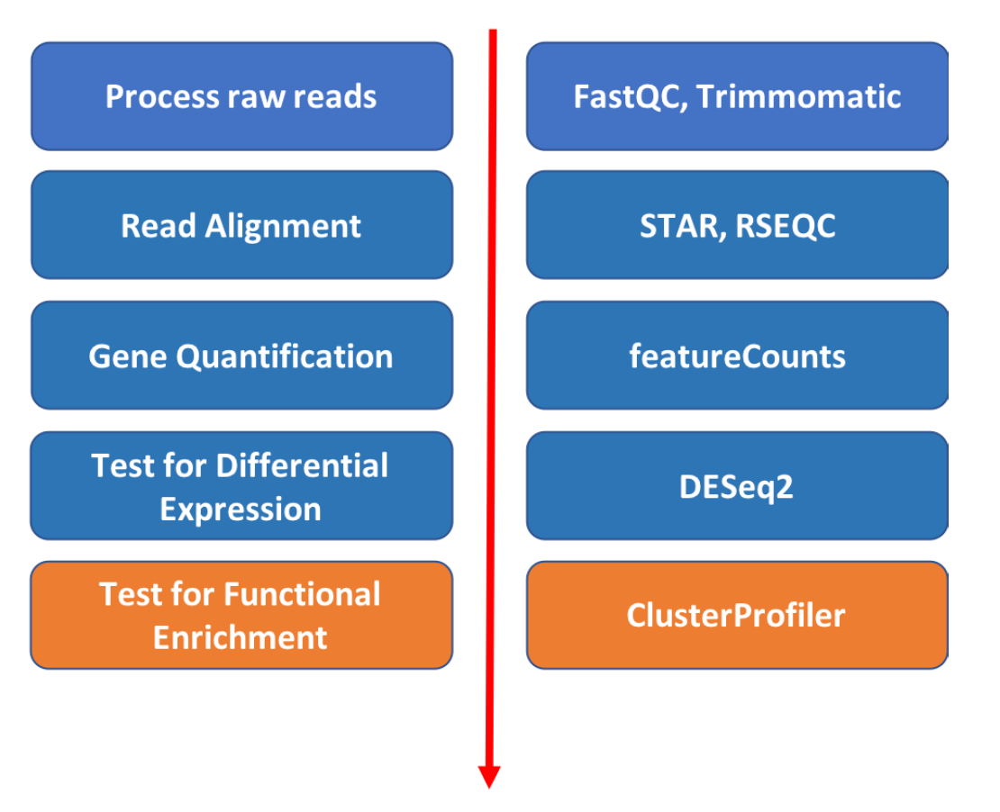
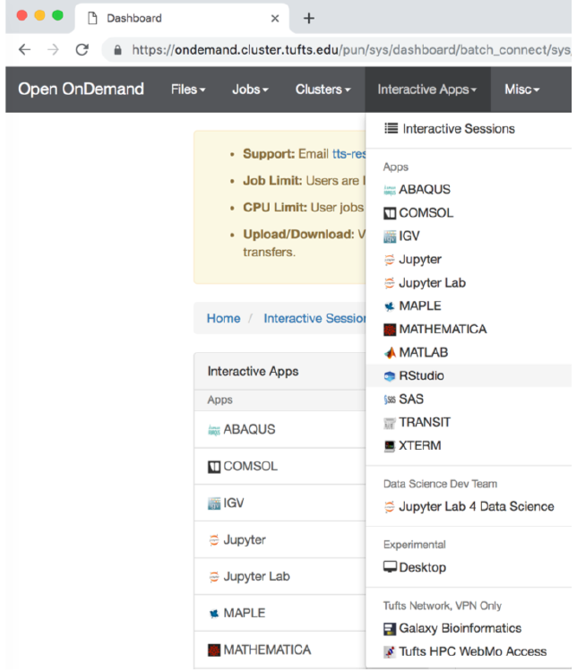
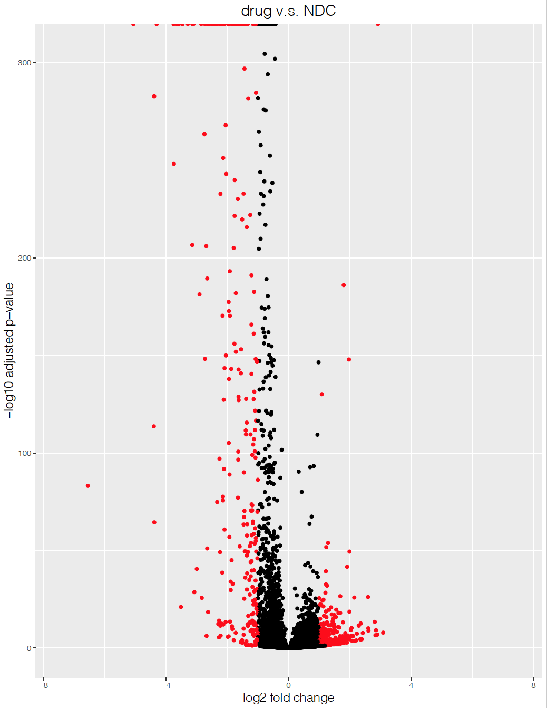
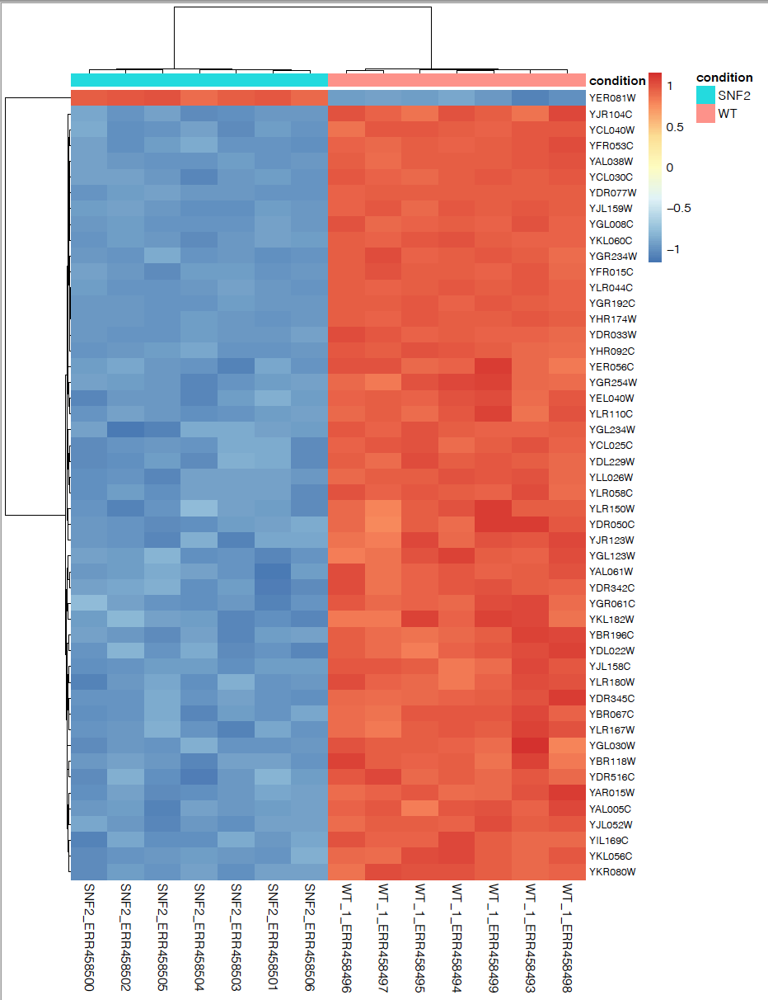
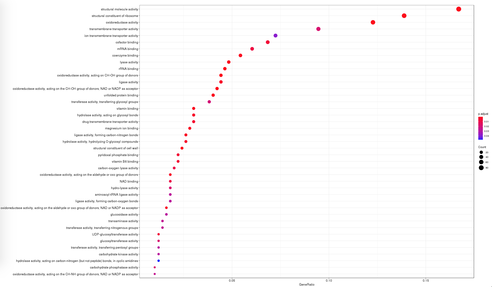
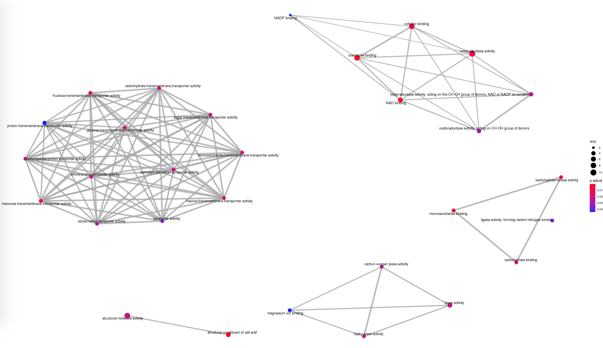

## Pathway enrichment analysis

Approximate time: 40 minutes

## Learning Objectives

- Use R to visulize DESeq2 results
- A few recommendations for functional enrichment analysis



## Step 1. Start Rstudio on the Tufts HPC cluster via "On Demand"
1. Open a Chrome browser and visit [ondemand.cluster.tufts.edu](ondemand.cluster.tufts.edu)
2. Log in with your Tufts Credentials
3. On the top menu bar choose Interactive Apps -> Rstudio


4. Choose:

```markdown
Number of hours: 4
Number of cores: 1
Amount of Memory: 32 Gb
R version: 3.5.0
```

## Step 2. Load the previously saved R project
You should automatically see the previous work. If not, you can load the previous session following these steps:
Go to `File`, choose `Open Project...`, navigate to your folder and selected the previously saved file with extension of `.Rproj`. All previously saved variables and libraries will be loaded.

- **Visualization of DeSeq2 result**

##### Use Volcano plot to visualize up- and down- regulated Genes

```markdown
# load necessary library ggplot2
library(ggplot2)

# add another column in the results table to label the significant genes using threshold of padj<0.05 and absolute value of log2foldchange >=1
res_table <- res %>%
  data.frame() %>%
  rownames_to_column(var="gene") %>%
  as_tibble()
res_table <- res_table %>%
  mutate(threshold_OE =  padj < 0.05 & abs(log2FoldChange) >= 1)
# you can view the modified table
view(res_table)
# make volcano plot, the significant genes will be labeled in red
ggplot(res_table) +
  geom_point(aes(x = log2FoldChange, y = -log10(padj), colour = threshold_OE)) +
  scale_color_manual(values=c("black", "red")) +  # black v.s. red dots
  ggtitle("WT v.s. SNF2") +                       # this line defines the title of the plot
  xlab("log2 fold change") +                      # this line defines the name of the x-axis
  ylab("-log10 adjusted p-value") +               # name of y-axis
  scale_x_continuous(limits = c(-7.5,7.5)) +      # the axis range is set to be from -7.5 to 7.5
  theme(legend.position = "none", #c(0.9, 0.9),
        plot.title = element_text(size = rel(1.5), hjust = 0.5),
        axis.title = element_text(size = rel(1.25)))  
```
The commands will generate a volcano plot as shown below



##### Plot top 50 significant genes in a heatmap
Sort the rows from smallest to largest padj and take the top 50 genes:
```markdown
significant_results_sorted <- significant_results[order(significant_results$padj), ]
significant_genes_50 <- rownames(significant_results_sorted[1:50, ])
```
We now have a list of 50 genes with most significant padj value. But we need to find the counts corresponding to these genes. To extract the counts from the rlog transformed object:
```markdown
rld_counts <- assay(rld)
```
Select by row name using the list of genes:
```markdown
rld_counts_sig <- rld_counts[significant_genes_50, ]
```
Plot multiple genes in a heatmap:
```markdown
pheatmap(rld_counts_sig,
cluster_rows = T,
show_rownames = T,
annotation = meta,
border_color = NA,
fontsize = 10,
scale = "row",
fontsize_row = 8,
height = 20)
```


## Next step: Functional Enrichment

##### Functional enrichment using R library clusterProfiler

To run the functional enrichment analysis, we first need to select genes of interest. Here we are interested in the 500 genes with lowest padj value (or the 500 most significantly differentially regulated genes). To do this, we first rank the previous result using padj value, then we select the gene names for the top 500. The list of 500 genes will be passed into enrichGO program and be analyzed for GO enrichment. Below are the codes needed to perform enrichment analysis.

```
## load required library
library(clusterProfiler)

## load the proper database for your organism of interest
library(org.Sc.sgd.db)

## Run GO enrichment analysis for the top 500 genes
significant_results_sorted <- res[order(res$padj), ]
significant_genes_500 <- rownames(significant_results_sorted[1:500, ])
ego <- enrichGO(gene = significant_genes_500,
                         keyType = "ENSEMBL",
                         OrgDb = org.Sc.sgd.db)

## Output results from GO analysis to a table
cluster_summary <- data.frame(ego)
## Show a Dotplot
dotplot(ego, showCategory=50)
## Enrichmap clusters the 50 most significant (by padj) GO terms to visualize relationships between terms
emapplot(ego, showCategory = 50)
```
After you ran these codes, a dotplot and a emapplot will be generated.

- **Dotplot: pathway enrichment**




- **emapplot: pathway interaction**




If your organism happens to be within the clusterprofiler database as shown below, you can easily use the code above for functional enrichment analysis.


A great tutorial to follow for functional enrichment can be found at
[https://hbctraining.github.io/DGE_workshop/lessons/09_functional_analysis.html](https://hbctraining.github.io/DGE_workshop/lessons/09_functional_analysis.html)

##### Pathway analysis using other tools

If your organism is not within the above database, you will have to pick your gene of interest (using log2 fold change cutoff and/or padj cutoff) and analyze the functional enrichment using [String](https://string-db.org) or [Blast2Go](https://www.blast2go.com).


## Review all Scripts
- [Command line scripts](08_bash_scripts.md)
- [R scripts](09_R_scripts.md)

## Workshop Schedule
- [Course Home](../README.md)
- [Introduction](slides/RNAseq_intro_RB_28May20.pdf)
- [Setup using Tufts HPC](01_Setup.md)
- [Process Raw Reads](02_Quality_Control.md)
- [Read Alignment](03_Read_Alignment.md)
- [Gene Quantification](04_Gene_Quantification.md)
- [Differential Expression](05_Differential_Expression.md)
- Currently at: Pathway Enrichment
